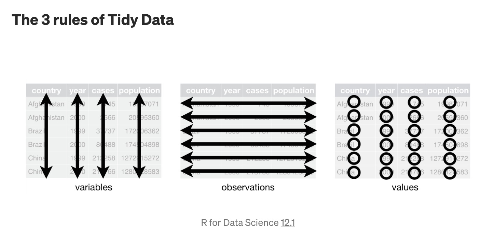

Dans cet exercice, nous examinons les différences transnationales dans les attitudes envers la violence domestique et l'accès à l'information. Nous explorons l’hypothèse selon laquelle il existe une association à un niveau global, entre la mesure dans laquelle les individus dans un pays ont accès à la connaissance et aux nouvelles informations, à la fois, à travers la scolarisation formelle et par les médias, et leur probabilité de condamner les actes de violence conjugale. Cet exercice est en partie basé sur:

Pierotti, Rachel. (2013). "[Increasing Rejection of Intimate Partner Violence: Evidence of Global Cultural Diffusion](http://dx.doi.org/10.1177/0003122413480363)." *American Sociological Review*, 78: 240-265. 

Nous utilisons les données des enquêtes démographiques et de santé (EDS), qui représentent un ensemble de plus de 300 enquêtes représentatives à l'échelle nationale, régionale et résidentielle menées dans des pays en développement du monde entier depuis 1992. Les enquêtes utilisent un plan d'échantillonnage en grappes, stratifié à deux degrés. Dans la première étape, les zones de dénombrement (ZD) sont tirés des fichiers de recensement. Dans la deuxième étape, dans chaque ZD, un échantillon de ménages est tiré d’une liste actualisée de ménages. En outre, les enquêtes ont des questionnaires identiques et des formations identiques pour les enquêteurs, permettant de comparer directement les données d'un pays avec celles collectées dans d'autres pays. Il est important de noter que différents groupes de pays sont interrogés chaque année.

Dans l'étude, l'auteur a utilisé ces données pour montrer que «les femmes ayant un meilleur accès aux scripts culturels mondiaux grâce à la vie urbaine, à l'enseignement secondaire ou à l'accès aux médias étaient plus susceptibles de rejeter la violence entre partenaires intimes». Les données se trouvent dans le fichier csv `dhs_ipv.csv`. Les noms et descriptions des variables sont les suivants:


Name             Description
---------------  ---------------------------------------------------------
`beat_goesout`     Pourcentage de femmes dans chaque pays qui pensent qu'un mari est justifié de battre sa femme
                 si elle sort sans le lui dire. 
`beat_burnfood`    Pourcentage de femmes dans chaque pays qui pensent qu'un mari a                                le droit de battre sa femme
                 si elle brûle sa nourriture.  
`no_media`         Pourcentage de femmes dans chaque pays qui ont rarement accès un 
                 journal, une radio ou une télévision.
`sec_school`       Pourcentage de femmes dans chaque pays ayant un niveau d'éducation                             secondaire ou supérieur.
`year`             Année de l'enqueête
`region`           Région du monde
`country`          pays


Notez qu'il existe deux indicateurs d'*attitudes envers la violence domestique*: `beat_goesout` et `beat_burnfood`. Ce sont ces variables que nous voulons expliquer/comprendre. On les appelle des variables dépendantes ou variables à expliquer ou des `outcomes`. Il existe également deux indicateurs d'*accès à l'information*: `sec_school` et `no_media`. Celles-ci sont appelées des variables explicatives.

Comme toujours, il faut prévoir un premier *chunck* où vous installez vos packages, les chargez et chargez la base de données. C'est une procédure qu'il faut toujour suivre. Sachez aussi que vous devez ouvrir ce fichier RMarkDown et travailler directement dedans.


```{r, results='hide'}
rm(list = ls())     # Permet d'éffacer l'environnement

# Chargement 
library(tidyverse)
library(pander)

dhs <- read.csv("../Data/dhs_ipv.csv")
# Information rapide sur les données
head(dhs)
```


## Question 1: 

Commençons par comprendre les caractéristiques de l'échantillon. 
- Quelle est la taille de l'échantillon?
- Quelle est la nature (type) des deux variables dépendantes et des deux variables indépendante?
- Combien y a-t-il d'informations manquantes dans chaque variable de la base de données? Pouvez-vous suggérer des explications quant à la présence des valeurs manquantes dans les données?


### Réponse 1

### Votre code dans le chunck

```{r}

summary(dhs)

```

### Votre interpretation (texte)

- Taille échantillon: 151. Les données concernent ... pays dont plusieurs données sur le même pays.
- Nature des variables:
  - Toutes les variables sont de type quantitative (ou variable continue)
  - Variables dépendantes: Les variables qu'on cherche à expliquer. beat_burnfood et beat_goesout.
  - Variables indépendantes: Les variables qui permettent d'expliquer les variables dépendantes. sec_school et no_media.
  
- Données manquantes
  - beat_burnfood : 31
  - beat_goesout : 27
  _ sec_school : 3
  - no_media : 13
  
- Raison des variables manquantes
  - Pour les variables beat_burnfood et beat_goesout et no_media: probablement que les questions sur l'attitude de femmes sur la violence contre les femmes n'ont pas été posées au cours de cette période dans ces pays.
  - Pour sec_school, c'est plus difficile à donner les raisons des valeurs manquantes. Dans toutes les enquêtes, la question sur le niveau d'éducation est posée, spécialement dans les enquêtes EDS.


## Question 2 : 

Calculer les paramètres de *position* de nos quatre variables d'intérêt, globalement et par régions. Présentez les résultats statistiques dans un tableau de manière appropriée. Commentez les résultats. 
De même, calculer les paramètres de *dispersion* de nos quatre variables d'intérêt, globalement et par régions. Présentez les résultats statistiques dans un tableau de manière appropriée.  Commentez les résultats. 

## Réponse 2

### Votre code dans le chunck

```{r}

position_burnfood <- 
  dhs %>% 
  summarise(v_min = min(beat_burnfood, na.rm = TRUE), 
            v_max = max(beat_burnfood, na.rm = TRUE), 
            v_moyen = mean(beat_burnfood, na.rm = TRUE), 
            v_median = median(beat_burnfood, na.rm = TRUE), 
            v_Q1 = quantile(beat_burnfood, prob = 0.25, na.rm = TRUE), 
            v_Q3 = quantile(beat_burnfood, prob = 0.75, na.rm = TRUE)
            ) %>% 
  mutate(Variable = "beat_burnfood")

position_burnfood  


dispersion_burnfood <-
  dhs %>% 
  summarise(v_etendue = max(beat_burnfood, na.rm = TRUE) - min(beat_burnfood, na.rm = TRUE), 
            v_ei = IQR(beat_burnfood, na.rm = TRUE), 
            v_ei1 = position_burnfood$v_Q3 - position_burnfood$v_Q1, 
            v_variance = var(beat_burnfood, na.rm = TRUE), 
            v_et = sd(beat_burnfood, na.rm = TRUE), 
            v_et1 = sqrt(v_variance)) %>% 
  mutate(Variable = "beat_burnfood") 

dispersion_burnfood

dispersion_burnfood %>% 
  pander

```


```{r}

position_goesout <- 
  dhs %>% 
  summarise(v_min = min(beat_goesout, na.rm = TRUE), 
            v_max = max(beat_goesout, na.rm = TRUE), 
            v_moyen = mean(beat_goesout, na.rm = TRUE), 
            v_median = median(beat_goesout, na.rm = TRUE), 
            v_Q1 = quantile(beat_goesout, prob = 0.25, na.rm = TRUE), 
            v_Q3 = quantile(beat_goesout, prob = 0.75, na.rm = TRUE)
            ) %>% 
  mutate(Variable = "beat_goesout")

position_goesout  


dispersion_goesout <-
  dhs %>% 
  summarise(v_etendue = max(beat_goesout, na.rm = TRUE) - min(beat_goesout, na.rm = TRUE), 
            v_ei = IQR(beat_goesout, na.rm = TRUE), 
            v_ei1 = position_goesout$v_Q3 - position_goesout$v_Q1, 
            v_variance = var(beat_goesout, na.rm = TRUE), 
            v_et = sd(beat_goesout, na.rm = TRUE), 
            v_et1 = sqrt(v_variance)) %>% 
  mutate(Variable = "beat_goesout")

dispersion_goesout

```


```{r}

position_school <- 
  dhs %>% 
  summarise(v_min = min(sec_school, na.rm = TRUE), 
            v_max = max(sec_school, na.rm = TRUE), 
            v_moyen = mean(sec_school, na.rm = TRUE), 
            v_median = median(sec_school, na.rm = TRUE), 
            v_Q1 = quantile(sec_school, prob = 0.25, na.rm = TRUE), 
            v_Q3 = quantile(sec_school, prob = 0.75, na.rm = TRUE)
            ) %>% 
  mutate(Variable = "sec_school")

position_school  


dispersion_school <-
  dhs %>% 
  summarise(v_etendue = max(sec_school, na.rm = TRUE) - min(sec_school, na.rm = TRUE),
            v_ei = IQR(sec_school, na.rm = TRUE), 
            v_ei1 = position_school$v_Q3 - position_school$v_Q1, 
            v_variance = var(sec_school, na.rm = TRUE), 
            v_et = sd(sec_school, na.rm = TRUE), 
            v_et1 = sqrt(v_variance)) %>% 
  mutate(Variable = "sec_school")

dispersion_school

```


```{r}

position_media <- 
  dhs %>% 
  summarise(v_min = min(no_media, na.rm = TRUE), 
            v_max = max(no_media, na.rm = TRUE), 
            v_moyen = mean(no_media, na.rm = TRUE), 
            v_median = median(no_media, na.rm = TRUE), 
            v_Q1 = quantile(no_media, prob = 0.25, na.rm = TRUE), 
            v_Q3 = quantile(no_media, prob = 0.75, na.rm = TRUE)
            ) %>% 
  mutate(Variable = "no_media")

position_media 


dispersion_media <-
  dhs %>% 
  summarise(v_etendue = max(no_media, na.rm = TRUE) - min(no_media, na.rm = TRUE),
            v_ei = IQR(no_media, na.rm = TRUE), 
            v_ei1 = position_media$v_Q3 - position_media$v_Q1, 
            v_variance = var(no_media, na.rm = TRUE), 
            v_et = sd(no_media, na.rm = TRUE), 
            v_et1 = sqrt(v_variance)) %>% 
  mutate(Variable = "no_media")

dispersion_media

```


```{r}

# Paramètre de position des 4 variables

indicateur_position <- bind_rows(burnfood = position_burnfood, position_goesout, position_school, position_media)

indicateur_position

# Paramètres de dispersion des 4 variables

indicateur_dispersion <- bind_rows(dispersion_burnfood, dispersion_goesout, dispersion_school, dispersion_media)

indicateur_dispersion

```


### Alternative solution plus simple avec les commandes summarise_all et summarise_if

```{r}

position_all <-
  dhs %>% 
  select(beat_burnfood, beat_goesout, sec_school, no_media) %>% 
  summarise_all(funs(min = min(., na.rm = TRUE),
                     max = max(., na.rm = TRUE), 
                     moyen = mean(., na.rm = TRUE), 
                     median = median(., na.rm = TRUE), 
                     Q1 = quantile(. , prob = 0.25, na.rm = TRUE), 
                     Q3 = quantile(., prob = 0.75, na.rm = TRUE),
                     n = n()
            )) %>% 
  mutate(region = "All")

position_all  


position_all_region <-
  dhs %>% 
  group_by(region) %>% 
  select(beat_burnfood, beat_goesout, sec_school, no_media) %>% 
  summarise_all(funs(min = min(., na.rm = TRUE), 
            max = max(., na.rm = TRUE), 
            moyen = mean(., na.rm = TRUE), 
            median = median(., na.rm = TRUE), 
            Q1 = quantile(. , prob = 0.25, na.rm = TRUE), 
            Q3 = quantile(., prob = 0.75, na.rm = TRUE),
             n = n()
            ))

position_all_region  

para_position <- bind_rows(position_all_region, position_all)


```


On peut mieux organiser ces données, c'est-à-dire "tidyr".

http://vita.had.co.nz/papers/tidy-data.pdf

```{r}



```

tidyr — ensemble de fonctions pour vous aider à ranger vos données. Il a 5 catégories principalement:

1. Pivoting → pivot_longer() & pivot_wider()
2. Rectangling → unnest_longer(), unnest_wider(), hoist()
3. Nesting → nest() & unnest()
4. Splitting and combining columns → separate(),extract(), unite()
5. Missing Values→ complete(), drop_na(), fill(), replace_na()


```{r}

para_position

tidy_para_position <-
  para_position %>% 
  gather(stat, val, -region) %>% 
  separate(stat, into = c("var1", "var2", "stat")) %>% 
  spread(stat, val) %>% 
  unite("variable", c("var1", "var2"), sep = "_", remove = TRUE)  %>% 
  select(region, variable, min, max, moyen, median, Q1, Q3, n) %>% 
  arrange(variable) 

  tidy_para_position
  

ggplot(tidy_para_position) +
  geom_col(aes(x = region, y = moyen)) +
  facet_wrap(~ variable)


df <- data.frame(x = c(NA, "a1b", "c4d", "e9g"))
df %>% separate(x, c("A","B"), sep = "[0-9]")

```


## Votre interpretation (texte)


## Question 3 :

Ces statistiques nous donnent une description de l'ensemble de l'échantillon. On peut toutefois aussi présenter les informations sous formes graphiques. Présenter quatre graphiques `Boxplot` donnant la distribution de chacune des quatre variables d'intérêt selon la région d'étude? Commenter les résultats?
Est-ce qu'il se dégage une relation entre ces quatre variables (spécialement, d'un côté les deux indicateurs d'*attitudes envers la violence domestique* et les deux indicateurs d'accès à l'information )

## Réponse 3

### Votre code dans le chunck

```{r}

# beat_burnfood
ggplot(dhs) +
  geom_boxplot(aes(y = beat_burnfood)) +
  facet_wrap(~ region)


# no-media
ggplot(dhs) +
  geom_boxplot(aes(y = no_media)) +
  facet_wrap(~ region)

```

## Votre interpretation (texte)

La première boîte à moustaches montre qu'en Asie, en Amérique latine et au Moyen-Orient / Asie centrale, la distribution médiane de la distribution de `beat_burnfood` est également basse. Cependant, par rapport à l'Amérique latine, les attitudes des femmes sont plus dispersées au Moyen-Orient / Asie centrale et en Asie. Plus important encore, nous pouvons voir qu'en Afrique subsaharienne, la médiane de la distribution est nettement plus élevée que dans les autres régions et plus dispersée si l'on se base sur l'intervalle interquartile. Nous notons également la présence de pays aberrants en Asie, au Moyen-Orient / Asie centrale et en Afrique subsaharienne.

De plus, nous constatons des différences importantes dans la distribution de la faible exposition aux médias. Au Moyen-Orient et en Asie centrale, la distribution médiane se situe autour de r (médiane (dhs $ no_media [région $ dhs == "Moyen-Orient et Asie centrale"], na.rm = TRUE), 2) `% et est fortement concentrée autour de cette valeur. En Afrique subsaharienne, la médiane est égale à `r ronde (médiane (dhs $ no_media [dhs $ région ==" Afrique subsaharienne "], na.rm = TRUE), 2)` % et il existe de grandes disparités dans la distribution.

Dans le cas de l'éducation, l'Asie et l'Amérique latine ont des distributions similaires; environ 30% des femmes dans la moitié inférieure de la distribution ont un enseignement secondaire ou supérieur. Au Moyen-Orient / Asie centrale, la médiane de l’éducation des femmes est de `r (médian(dhs$sec_school[dhs$region ==" Moyen-Orient et Asie centrale "], na.rm = TRUE), 2)`%, Bien que nous puissions constater une plus grande dispersion entre les pays à en juger par les différences entre le premier et le troisième quartile de la distribution. En revanche, en Afrique subsaharienne, la médiane de la distribution n’est que `r (médian(dhs$sec_school[dhs$region == "Afrique subsaharienne"], na.rm = TRUE), 2)`% et la dispersion est également plus grande entre les pays de la moitié supérieure de la distribution.


## Question 4 : 

Examinons maintenant de manière concrète, l'association entre les attitudes envers la violence entre partenaires intimes et les deux variables d'exposition à l'information dans nos données. Utilisez des diagrammes de dispersion (**scatter plot**) pour examiner la relation bidimensionnelle entre `beat_goesout` et` no_media` ainsi qu'entre `beat_goesout` et `sec_school`. Répétez ces graphiques bivariés entre `beat_burnfood` et` no_media`, ainsi que `beat_burnfood` et` sec_school`. Veillez à ajouter des étiquettes d'axes informatives. Interpréter brièvement ces graphiques à la lumière de l’hypothèse de l’étude.


## Réponse 4

### Votre code dans le chunck

```{r}

ggplot(dhs) +
  geom_point(aes(x = sec_school, y = beat_burnfood))

ggplot(dhs) +
  geom_point(aes(x = sec_school, y = beat_burnfood, color = region))

ggplot(dhs) +
  geom_point(aes(x = sec_school, y = beat_burnfood)) +
  facet_wrap(~region)

ggplot(dhs) +
  geom_point(aes(x = sec_school, y = beat_burnfood, color = region)) +
  geom_smooth(aes(x = sec_school, y = beat_burnfood, color = region), method = 'lm', se = FALSE)


ggplot(dhs, aes(x = sec_school, y = beat_burnfood, color = region)) +
  geom_point() +
  geom_smooth(method = 'lm', se = FALSE)


```

## Votre interpretation (texte)

Globalement, ces graphiques suggèrent que l'association entre les attitudes à l'égard de la violence entre partenaires intimes, l'exposition aux médias et l'éducation des femmes se comporte dans la direction attendue. Par exemple, les graphiques bivariés montrent une relation positive claire entre le pourcentage de femmes peu médiatisées et le pourcentage de femmes qui estiment que la violence du partenaire intime est justifiée dans des situations spécifiques, telles que `beat_goesout` et` beat_burnfood`. De même, ces graphiques montrent une relation négative entre le pourcentage de femmes instruites et le degré d’accord avec la violence entre partenaires intimes.

## Question 5 : 

Maintenant, pensez à toutes les raisons possibles, des plus loufoques aux plus sérieuses qui mettent en doute les relations observées à la question 4. 

## Réponse 5


## Question 6: 

Un des points importants de l’hypothèse du chercheur est que le soutien à la violence entre partenaires intimes devrait *diminuer* avec le temps, étant donné que de plus en plus de femmes dans toutes les régions ont accès à une éducation formelle et à une exposition aux médias. Pour tester cette idée, en utilisant des diagrammes de séries chronologiques, examinez les tendances de `beat_burnfood` de 1999 à 2014 *dans chaque région*. En pensant à la conception de l'étude, que devrions-nous considérer avant de croire que cette figure montre un changement dans le temps dans les attitudes?  

## Réponse 6 

### Votre code dans le chunck

```{r}

ggplot(subset(dhs, country == "Armenia")) +
  geom_line(aes(x = year, y = beat_burnfood))


ggplot(dhs, aes(x = year, y = beat_burnfood)) +
  geom_line(aes(group = country, color = region))  +
  geom_point(aes(color = region))


dhs_subset <-
  dhs %>% 
  group_by(region, year) %>% 
  summarise(mean_bf = mean(beat_burnfood, na.rm = TRUE),
            mean_year = mean(year, na.rm = TRUE))

head(dhs_subset)

ggplot(dhs_subset, aes( x = mean_year, y = mean_bf)) +
  geom_line(aes(group = region, color = region))  +
  geom_point(aes(color = region))

```

## Votre interpretation (texte)

Le graphique chronologique ne montre pas de tendance à la baisse des attitudes envers la violence domestique dans aucune des régions. Cependant, chaque année varie en fonction des pays qu’elle représente. Ce graphique ne donne donc pas une image précise de l’évolution des attitudes à l’égard de la violence domestique.


