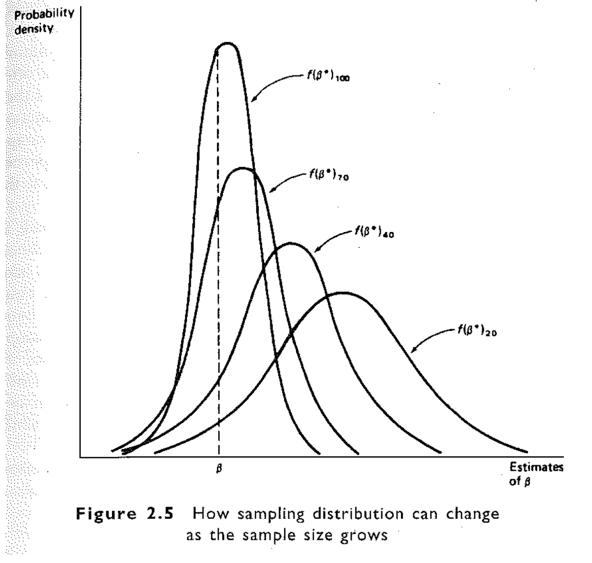

## Plan de présentation

- Rappel sur la régression linéaire simple
- Les propriétés d'un estimateur


Rappel sur la régression linéaire simple
======================================================

## Type de modèles

<!--
Variable dépendante      Méthodes d'analyse         Exemples
------------------------ -------------------------- ----------------------------
Continue                 Régression linéaire        Revenu
Binaire (dichotomique)   Régression logistique      
                         Régression probit
Durée                    Modèles de survie          Age au premier mariage
Texte                    Modèle textuel

-->

- Le type de méthodes dépend du type de **variable dépendante** 


## Spécification


$$ Y_i = \alpha + \beta X_i + \epsilon_i$$
$$ E(Y_i) = \alpha + \beta X_i $$


## Hypothèses

## Voir fichier additionnel

Lecture8_Classical_Linear_Regression.pdf (slides 22 à 36)
<!--
## Relation linéaire

Hypothèse                           Expression                                   Violation
----------------------------------- -------------------------------------------- ------------------------------------------    

Y est une fonction linéaire de X    $$Y_i = \beta_0 + \beta_1*X_i + \epsilon_i$$   Mauvais régresseurs
                                                                                 Non linéarité
                                                                                 Paremètres changeants


-->


## Dérivation de alpha et beta

- On cherche à minimiser la distance au carré entre chaque observation et la droite, d'où le nom d'estimateur des **moindres carrés ordinaires (MCO)**

$$ Min\sum(\epsilon_i^2) = \sum(Y_i - \alpha - \beta X_i)^2 = Min(S)$$

- EN opérant par dérivation:
$$\delta S/\delta \alpha = 0 $$ 
$$\delta S/\delta \beta = 0$$ 

## Alpha et beta

$$\hat{\alpha} = \bar{Y} -  \hat{\beta} \bar{X}$$
$$\hat{\beta} = \frac{\sum_{i=1}^n(Y_i - \bar{Y})(X_i - \bar{X})}{\sum_{i=1}^n(X_i - \bar{X})^2}$$

Les propriétés d'un estimateur
======================================================

## Définition

- Un estimateur est simplement une **fonction algébrique** d’un échantillon potentiel de données; une fois que l'échantillon est tiré, cette fonction crée une estimation numérique réelle.
- Il existe un nombre infini de façons différentes par lesquelles un échantillon de données peut être utilisé pour produire une estimation de $\theta$, toutes sauf quelques-unes produisant de «mauvaises» estimations.
- $\theta$ est le paramètre, par exemple la taille d'une population
- Votre tâche consiste à produire de **«bons»** estimateurs, qui à leur tour produisent des «bonnes» estimations.

## Définition

- L’économétrie porte sur la manière de générer un «bon» estimateur dans une situation d’estimation donnée.

- Une nuance doit être faite entre un "bon" estimateur et un estimateur "préféré", ce dernier est entre les mains de la personne qui effectue l'estimation, car ce sont ses jugements de valeur qui déterminent lequel de ces critères est le plus important.

- Nous décrivons un certain nombre de critères que les économétriciens considèrent comme des mesures du «bon»:
 - Coût de calcul, 
 - $R^2$ le plus élevé, 
 - Absence de biais, 
 - Efficacité, 
 - Erreur quadratique moyenne (MSE), 
 - Propriétés asymptotiques

## Coût de calcul

- Le bénéfice supplémentaire associé au choix d’un estimateur par rapport à un autre doit être comparé à son coût supplémentaire, le coût se rapportant à la dépense d’argent et d’effort.

- Pas un gros problème aujourd'hui à cause de:
  - Disponibilité des ordinateurs à grande vitesse
  - Disponibilité des routines d'estimations dans plusieurs logiciels standards

## Absence de biais

- On dit qu'un estimateur $\beta^*$ est un estimateur **non biaisé** de $\beta$ si la moyenne de sa **distribution d'échantillonnage** est égale à $\beta$, c'est-à-dire si la valeur moyenne de $\beta^*$ dans un échantillonnage répété est $\beta$

- La moyenne de la distribution d'échantillonnage de $\beta^*$ s'appelle la **valeur attendue** ou l'**espérance** de $\beta^*$ et s'écrit $E\beta^*$.

- Le biais de $\beta^*$ est la différence entre $E(\beta^*)$ et $\beta$

- La propriété de **non biais** ne signifie pas que $\beta^*$ = $\beta$

## Absence de biais

```{r rline, echo=FALSE, fig.cap="", out.width = '100%'}
knitr::include_graphics("../Images/non_biais.png")

```


## Efficacité

- Dans certains problèmes économétriques, il est impossible de trouver un estimateur non biaisé

- Mais chaque fois qu'un estimateur non biaisé peut être trouvé, il est généralement le cas d'un grand nombre d'autres estimateurs non biaisés.

- L'estimateur **efficient** ou le **meilleur estimateur non biaisé** est l'estimateur non biaisé dont la distribution d'échantillonnage présente la **plus petite variance**.

- Si le meilleur estimateur non biaisé est également linéaire, on l'appelle le **meilleur estimateur linéaire sans biais (BLUE)**

## Efficacité

```{r, echo=FALSE, fig.cap="", out.width = '100%'}
knitr::include_graphics("../Images/efficacite.png")

```


## Erreur quadratique moyenne (MSE - Mean Squarre Error)

- Le compromis entre faible biais et faible variance est formalisé en utilisant comme critère la **minimisation** d'une moyenne pondérée du **biais** et de la **variance**.

- Lorsque les poids sont égaux, le critère est le critère de l'**erreur quadratique moyenne** (MSE)

- $$ MSE = Var\beta^* + (E\beta^* - \beta)^2$$
- En pratique, le critère de la MSE n'est généralement pas adopté, à moins que le meilleur critère non biaisé ne permette pas de produire des estimations présentant de petites variances.

Propriétés asymptotiques
=====================================

## Distribution asymptotique

- La distribution d'échantillonnage de la plupart des estimateurs change avec la taille de l'échantillon

- Considérons la séquence des distributions d'échantillonnage d'un estimateur $\beta^*$, formée en calculant la distribution d'échantillonnage de $\beta^*$ pour des tailles d'échantillon de plus en plus grandes

- Si les distributions de cette séquence deviennent de plus en plus similaires à une distribution spécifique (telle qu'une distribution normale), à mesure que la taille de l'échantillon devient extrêmement grande, cette distribution spécifique est appelée **distribution asymptotique** de $\beta^*$


## Consistence (Consistency)

- Si la distribution asymptotique de $\beta^*$ se concentre sur une valeur particulière k à mesure que la taille de l'échantillon se rapproche de l'infini, k est réputé être la limite de probabilité de $\beta^*$ et s'écrit $plim\beta^* = k$;

- Si $plim\beta^* = \beta$, alors $\beta^*$ est dit consistent.

## Propriétés asymptotiques : Consistence (Consistency)

```{r, echo=FALSE, fig.cap="", out.width = '100%'}

```


## Propriétés asymptotiques : Efficacité asymptotique

- La variance de la distribution asymptotique de $\beta^*$ est appelée la variance asymptotique de $\beta^*$;

- Si $\beta^*$ est consistent et que sa variance asymptotique est inférieure à la variance asymptotique de tous les autres estimateurs consistents, on dit que $\beta^*$ est **asymptotiquement efficace.**


Propriétés des estimateurs alpha et beta (régression linéaire simple)
======================================================================

## Propriété de l'estimateur $\beta$ 

On démontre que :

$$ E(\beta^*) = \beta$$ 
$$ Var(\beta^*) = \sigma_\epsilon^2/\sum(X_i - \bar{X})^2$$

- $\beta$ est non biaisé

- Cet estimateur est d'autant plus précis que le dénominateur est grand c'est-à-dire:
  - le nombre d'observation est important
  - et/ou les valeurs de la variable explicative (ou dépendante) sont très dispersées autour de la moyenne


## Propriété de l'estimateur $\alpha$ 

On démontre que :

$$ E(\alpha^*) = \alpha$$ 
$$ Var(\alpha^*) = \sigma_\epsilon^2[1/n + \bar{x}^2/\sum(x_i - \bar{X})^2]$$

- On remarquera que dans le calcul de la variance de $\alpha$ et de $\beta$, il intervient la valeur de $\sigma_\epsilon$. Or, la variance des termes d'erreur est non connue. Il faut donc l'estimer.

- C'est à ce niveau que l'hypothèse de normalité intervient. Dans les faits, on n'en a pas besoin pour estimer $\alpha$ et $\beta$


## Conséquences de l'hypothèse de normalité

Le résidu est donné par:

$$e_i = y_i - \hat{y_i} = y_i - \alpha^* - \beta^*x_i$$

- On démontre qu'une estimation de $\sigma_\epsilon$ est:

$$\sigma_\epsilon^* = 1/(n-2)*\sum e_i^2$$


- On remplace finalement l'estimé de sigma dans les équations de la variance de alpha et beta pour avoir les estimateurs empiriques de chacun des coéficients.

## Équation d'analyse de la variance

On démontre que :

- $\sum e_i = 0$ : la somme des résidus est nulle (la droite de régression passe par le point moyen)

- $\bar{y} = \bar{\hat{y}}$

- Et on tire que 
 
$$\sum(y_i - \bar{y})^2 = \sum(\hat{y} - \bar{\hat{y}})^2 + \sum e_i^2$$
- SCT (somme des carrés totale) = SCE (somme des carrés expliquées) + SCR (somme des carrés des résidus)

## Qualité de l'ajustement d'un modèle

- l'équation précédente va nous permettre de juger de la qualité de l'ajustement d'un modèle. 
- En effet, plus la variance expliquée est proche de la variance totale, melleure est l'ajustement du nuage de points par la droite des moindres carrés. 
- Il est obtenu par le rapport:

$$R^2 = \frac{\sum(\hat{y} - \bar{y})^2}{\sum(y_i - \bar{y})^2} = 1 - \frac{\sum e_i^2}{\sum(y_i - \bar{y})^2} $$

## Tests statistiques

On démontre que:

- $\frac{\beta^* - \beta}{\hat\sigma_\beta^*}$ et $\frac{\alpha^* - \alpha}{\hat\sigma_\alpha^*}$ suit une loi de Student à n-2 degrés de liberté

- Cela permet ainsi de tester si les coefficents estimés sont différents d'une valeur donnée

- Sous l'hypothèse $H_0 : \beta = 0$, le ratio de student, $t_{\beta^*}^* = \frac{\beta^*}{\hat\sigma_\beta^*}$

- Si $t_{\beta^*}^*$ est inférieur à $-t_{n-2}^{\alpha/2}$ ou supérieur à $t_{n-2}^{\alpha/2}$, on rejète l'hypothèse nulle.
- Dans le cas contraire, nous ne sommes pas en mesure de rejeter $H_0$. Le coéficient $\beta$ n'est donc pas significativement différent de 0. La variable x n'est donc pas explicative de y.


## Test de significativité globale du modèle

On démontre aussi que:

- $F^* = \frac{SCE/ddl_{SCE}}{SCR/ddl_{SCR}}$ suit une loi de Fisher à 1 et n-2 degrés de liberté. 

cette statistique permet de tester l'hypothèse que :
- SCE = 0 (que les variables explicatives ne contribuent pas à l'explication du modèle). 
- Cela équivaut à dire que dans le cas d'un modèle linéaire simple que $\beta = 0$

- Si $F^* > F_{1; n-2}^\alpha$, nous rejetons au seuil de $\alpha$ l'hypothèse $H_0$. La variable x est significative.
- Dans le cas contraire, nous acceptons l'hypothèse $H_0$, la variable x n'est pas explicative de la variable y


TP2
====================
