## Plan de présentation

- Validité des hypothèses
- Violation des hypothèses
- Interaction
- Paramètres changeant: Interaction
- Variables importantes omises


Validité des hypothèses
=============================================================


## Validité des hypothèses: analyse des résidus

- Présenter un graphique des résidus par rapport aux valeurs prédites

- Représenter les résidus par rapport à un régresseur spécifique

- Ce que ce graphique montre est une indication de:
  - Non-linéarité
  - Non-normalité de
  - Hétéroscédasticité

<!-- Les résultats de la régression ne sont fiables que dans la mesure où les hypothèses sous-jacentes sont respectées. Le tracé des résidus et le calcul de certaines statistiques de test permettent de déterminer si les hypothèses telles que l'homoscédasticité, la corrélation sérielle et la normalité des erreurs ne sont pas violées. Dans R, les résidus sont stockés dans le vecteur résidus de la sortie de la régression. -->


## Résidus versus les valeurs prédites de Y


```{r, echo=FALSE, out.width='80%'}

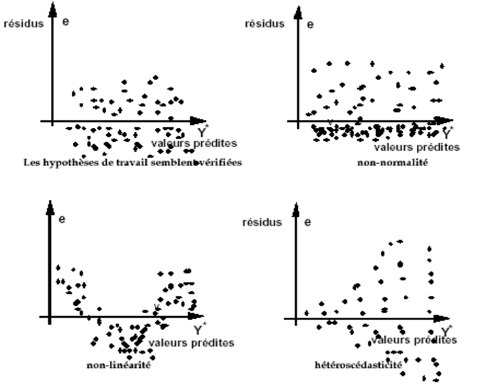
```


## Résidus versus une variable indépendante spécifique

```{r, echo=FALSE, out.width='80%'}

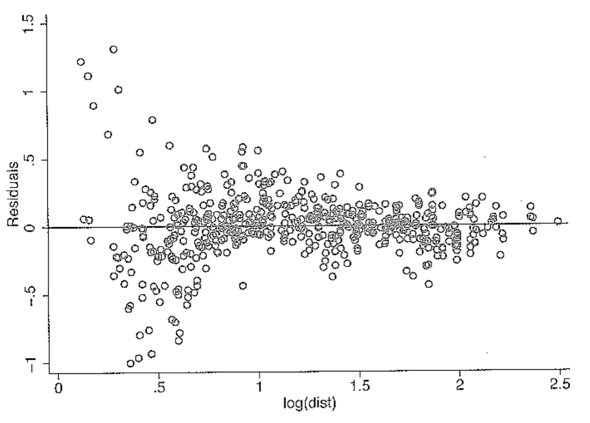
```

## Exemple 1: Homoscédasticité

$$Y_i = 1 + x_i + \epsilon_i$$

```{r, echo=FALSE, message=FALSE, warning=FALSE, out.width='70%'}

library(tidyverse)
set.seed(12345)   #sets the seed for the random number generator
x <- runif(300, 0, 10)
e <- rnorm(300, 0, 1)
y <- 1+x+e
data <- data.frame(y, x, e)

mod3 <- lm(y~x)
ehat <- resid(mod3)

data <-
  data %>% 
  mutate(ehat = resid(mod3))

ggplot(data) +
  geom_point(aes(x = x, y = ehat)) 

```

- On va que la variance de l'erreur est la même quelque soit la valeur de x.
- Nous sommes en présence de l'homoscédasticité.

## Exemple 2: Non linéarité

- L'exemple suivant illustre l'aspect des résidus lorsqu'une forme fonctionnelle linéaire est utilisée alors que la véritable relation est, en fait, quadratique.

$$ y_i = 15 - 4x_i^2 + \epsilon_i$$

```{r, echo=FALSE, message=FALSE, warning=FALSE, out.width='70%'}
set.seed(12345)
x <- runif(1000, -2.5, 2.5)
e <- rnorm(1000, 0, 4)
y <- 15-4*x^2+e

data2 <- data.frame(y, x, e)

mod3 <- lm(y~x)
ehat <- resid(mod3)
ymi <- min(ehat)
yma <- max(ehat)

data2 <-
  data2 %>% 
  mutate(ehat = resid(mod3))

ggplot(data2) +
  geom_point(aes(x = x, y = ehat)) 

#plot(x, ehat, ylim=c(ymi, yma),
#     xlab="x", ylab="residuals",col="grey")
```

## Exemple 3: Normalité des résidus

<!-- Une autre hypothèse que nous aimerions tester est la normalité des résidus, qui garantit la fiabilité des tests d'hypothèse et des intervalles de confiance, même dans les petits échantillons. Cette hypothèse peut être évaluée en inspectant un histogramme des résidus, ainsi qu'en effectuant un test de Jarque-Bera, pour lequel l'hypothèse nulle est "La série est normalement distribuée". Ainsi, une petite valeur de p rejette l'hypothèse nulle, ce qui signifie que la série échoue au test de normalité. Le test de Jarque-Bera nécessite l'installation et le chargement du package tseries dans R. La figure 4.7 montre un histogramme et une distribution normale superposée pour le modèle linéaire de dépenses alimentaires. -->


```{r, echo=FALSE, out.width='70%'}

data3 <- data2 %>% 
  mutate(yhat = predict(mod3))

ggplot(data3) +
  geom_point(aes(x = yhat, y = ehat)) 


```


Violation des hypothèses
=====================================================

## Violation des hypothèses

1. Non linéarité
2. Biais de spécification
3. paramètres non constants
4. Multicolinéarité
5. Hétéroscédasticité / perturbations autocorrélées 

## 1. Violation de l'hypothèse de linéarité: et si Y et X sont non linéaires?

- Souvent en sciences sociales, la relation entre Y et X n'est pas connue à l'avance
- Cette relation n'est pas toujours linéaire
- Deux approches:
  - Utiliser la régression non linéaire
  - Transformez les dépendants et / ou les prédicteurs

## 1. Violation de l'hypothèse de linéarité: et si Y et X sont non linéaires?

- Aucune relation linéaire entre le salaire et l'éducation 
- Besoin de transformation: 

  - log(salaire) = $\beta_0$ + $\beta_1$ * educ + $\epsilon$

## 1. Violation de l'hypothèse de linéarité: et si Y et X sont non linéaires?

```{r, echo=FALSE, out.width='80%'}

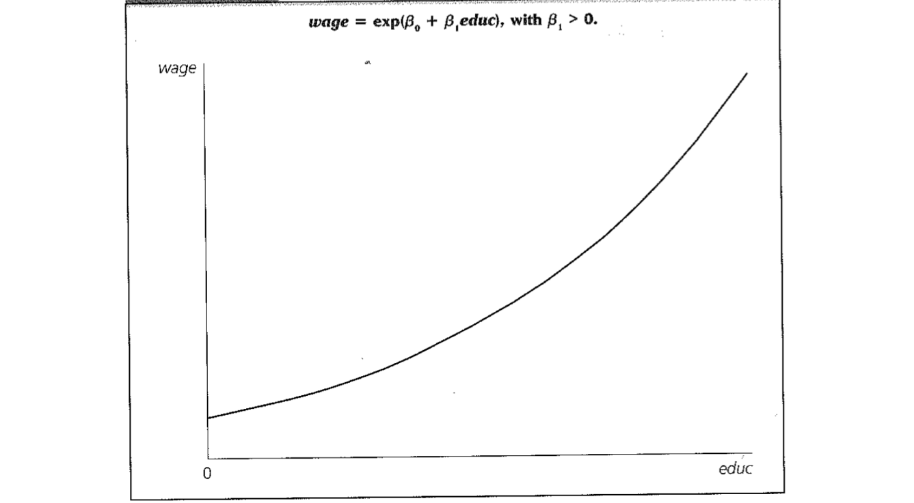

```


- Les estimations des paramètres par MCO sont biaisées
- Les résultats sont également difficiles à interpréter

## Transformations et interprétations

- Il arrive souvent qu'on transforme la variable dépendante, ou indépendante ou les deux en cas de violation de la linéarité. C'est le cas entre par exemple salaire et niveau d'éducation. Dans ces cas, l'interprétation n'est pas la même. 

Comment faire? Transformations

1. Transformer uniquement des variables indépendantes

- Si la vraie relation est: $y = a + bx + cx^2 + \epsilon$
- Une transformation consiste à créer $z = x^2$
- et estimer la nouvelle équation $y = a + bx + cz + \epsilon$

## Transformations et interprétations

2. Transformer l'équation entière

Considérer l'équation de Cobb Douglas):

- $Y = b_0X^{bi}_i\epsilon$

- Prendre le logarithme des deux côtés donne:
$logY = log b_0 + b_1logX_1 + ...  + b_klogX_k + log\epsilon$

- Une régression doit être faite sur la variable de transformation et cette relation est à nouveau linéaire

3. Si la transformation n'est pas possible, d'autres types d'estimation doivent être utilisés, par exemple par les Maximum de vraisemblance


## Transformations et interprétations

- Voici quelques transformations usuelles et leur interprétation


```{r, echo=FALSE, out.width='80%'}

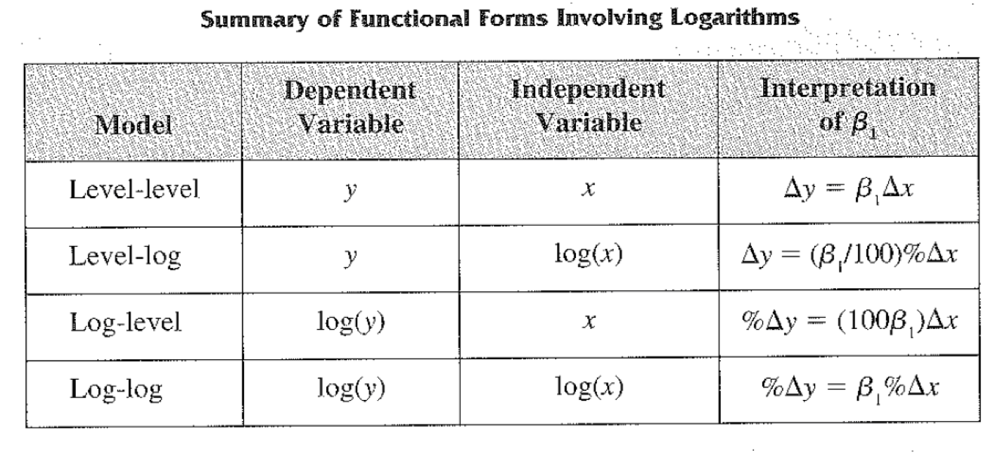

```


## Transformations et interprétations

1. Augmentation d'une unité de X entraîne un changement (augmentation ou diminution) de Y de B1 unité (effet sur Y)
2. Augmentation de 1% de X entraîne un changement de Y de (B1 / 100) unité (effet sur Y)
3. Augmentation d'une unité de X entraîne un changement de 100*B1% de Y (changement en % sur Y)
4. Augmentation de 1% de X entraine un changement de B1% de Y (changement en % sur Y)


## 2. Biais de spécification

1. Inclusion d'une variable indépendante non pertinente

- Relation vraie $Y = \beta_0 + \beta_1  X_1 + \beta_2  X_2 + \epsilon$
- Relation estimée: $Y = \beta_0 + \beta_1  X_1 + \beta_2  X_2 + \gamma Z +   \epsilon$
- Z n'est pas pertinent

**Conséquences**:

- Les paramètres estimés et leur matrice de variance-covariance sont **sans biais**
- À moins que le Z ne soit orthogonal aux autres X, la matrice de variance-covariance des paramètres estimés devient plus grande; 
- L'estimateur OLS n'est pas aussi efficace.


## 2. Biais de spécification: 

2. Ommission de variables importantes

- Relation vraie $Y = \beta_0 + \beta_1  X_1 + \beta_2  X_2 + \epsilon$

- Relation estimée: $Y = \gamma_0 + \gamma_1  X_1  +   \epsilon$

- Conséquences: En général $\gamma_0$ et $\gamma_1$ sont biaisés


## 2. Biais de spécification: 

2. Ommission de variables importantes

- Exemples

1. Est-ce que les pompiers détruisent les propriétés?
  - Constat: Plus le nombre de pompiers sur un site est grand, plus le dommage est important
  - D'où provient le problème?

2. Est que le nombre de livres à la maison augmente la réussite scolaire?
  - Constat: Plus il y a de livres à la maison, plus les enfants réussissent?
  - Quel est le problème?

- Voir vidéo : https://www.youtube.com/watch?v=pCIVVRHj5c8&list=PLwV5Cyu4EJ1BviLt-nWJFSTjW30Tawv2R&index=28


## 2. Biais de spécification: 

2. Ommission de variables importantes: sens du biais

- Relation estimée: $Y = \gamma_0 + \gamma_1  X_1  +   \epsilon$

==> Solution : $\hat\gamma_1 = \frac{COV(X_1, Y)}{VAR(X_1)}$

- Relation vraie $Y = \beta_0 + \beta_1  X_1 + \beta_2  X_2 + \epsilon$

- Alors: $\hat\gamma_1 = \frac{COV(X_1, \beta_0 + \beta_1  X_1 + \beta_2  X_2 + \epsilon)}{VAR(X_1)}$ 

- On montre que :

$\hat\gamma_1 = \beta_1 + \frac{COV(X_1, X_2)}{VAR(X_1)}$ 

- Est-ce que $E(\hat\gamma_1) = \beta_1$ ?


## 2. Biais de spécification: 

2. Ommission de variables importantes: sens du biais

```{r, echo=FALSE, out.width='80%'}

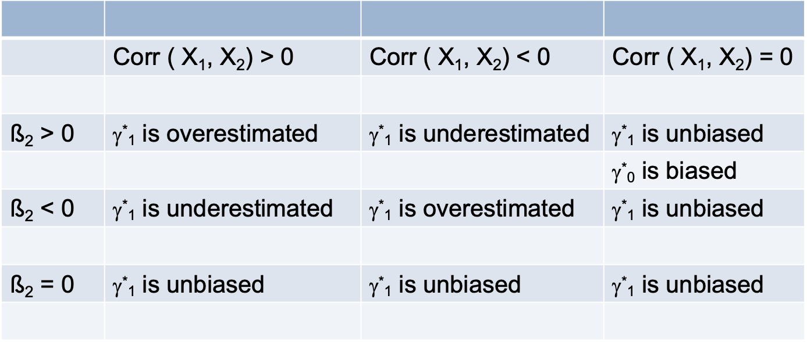

```


- Il n'est pas toujours facile de savoir l'effet de de la variable omise (ß2), ni le sens de la corrélation entre x1 et X2.

## 2. Biais de spécification: 

- Exemple: Prenez l'estimation de l'effet de l'éducation de la mère (X1) sur les résultats en math des enfants (Y). 

- Si vous estimez uniquement ce modèle sans l'inclusion de l'effet de l'éducation du père (X2), l'effet de l'éducation de la mère est sûrement biaisé. Dans quelle direction? Pour le savoir, vous devez utiliser les informations du tableau précédent.

- Voir mon papier: 

- https://www-sciencedirect-com.proxy.bibliotheques.uqam.ca/science/article/pii/S027795361730727X?via%3Dihub

- https://nouvelles.umontreal.ca/en/article/2018/01/31/better-educated-men-healthier-women-and-mothers-in-the-developing-world/


## 2. Biais de spécification: 

On sait que:

- l'effet attendu de l'éducation du père sur les résultats en math des enfants est posititif ($\beta_2$) >0

>- l'éducation de la mère est positivement correlé avec l'éducation du père: les gens de même niveau social se rassemblent (se marient). C'est ce qu'on appelle homophilie. Autrremnt dit, les femmes éduquées vont plus se marier avec les hommes éduqués, et vice versa. Donc corr(X1, X2) est positif. 

>- Dans ce cas, l'effet de l'éducation de la mère est sûrement biaisé vers le haut, autrement dit, cet effet est plus élevé que l'effet qu'on aurait obtenu si on avait pris en compte l'éducation du père.

## 2. Biais de spécification: 

Trouver un cas où l'effet est sous-estimé.

## 2. Biais de spécification

**Choix de variables**

- Avoir toutes les variables possibles : prolèmes avec les variables non pertinentes
- Sélection : problèmes d'omission de variables pertinentes

- Le choix doit être basé sur la théorie
- Si la théorie ne peut pas défendre l'utilisation d'une variable comme IV, elle ne doit pas être incluse comme variable indépendante


## 3. Paramètres non constants (changeants)

- L'effet de l'IV peut changer avec le temps ou d'une région à l'autre
- Les paramètres peuvent être déterminés par d'autres variables externes
- Ou peuvent-être aléatoires: régression multiniveaux
- Dans ce cas, l'hypothèse de paramètres constants doit être libérée
- Une régression spécifique dans chaque période ou dans chaque région doit être privilégiée.

## 3. Paramètres non constants (changeants)

- Test Chow pour les paramètres non constants
- Supposer que :
  - $Consommation_i = \beta_0 + \beta_1 Salaire_i + \beta_2 education_i + \epsilon_i$
  - Tester si les coefficients sont les mêmes dans la période 1 que dans la période 2
- Test Chow

  - Créez une variable fictive D = 1 pour l'observation de la période 2 et 0 pour l'observation de la période 1.
  - Exécutez la régression avec les termes d'interaction:
  
$$Consommation_i = \beta_0 + \beta_1 Salaire_i + \beta_2 Education_i + \gamma_0 D + \gamma_1 (D * Salaire) + \gamma_2 (D * Education) + \epsilon_i$$


## 3. Paramètres non constants (changeants)

- Si $\gamma_0 = \gamma_1 = \gamma_2$ alors les coefficients sont identiques pour les périodes 1 et 2.
- Utilisation du test F pour tester cette hypothèse:

$$\frac{[SSE(modèle contraint) - SSE(\text{modèle non contraint})]/K}{SSE(\text{modèle non contraint})/(T_1 + T_2 - 2K
)} $$

<!---->

- Où K est le nombre de paramètres, Ti nombre d'observations dans la période i (i = 1,2)


## Paramètres changeants: Interaction

- Vérifier si le coefficient de régression d'une variable indépendante (X1) varie en fonction des valeurs d'une autre variable indépendante (X2)
- On dit que X2 modère la relation entre X1 et la variable dépendante (Y)

- Plus fréquent entre les variables indépendantes qualitatives et continues
- Moins commun entre variable continue, mais plus facile à interpréter


## Exemple

- Interaction entre deux variables continues
- $Salaire = \beta_0 + \beta_1 Etudes + \beta_2 Experience + \epsilon$

```{r, echo=FALSE, out.width='80%'}

knitr::include_graphics("../../Images/interaction1.png")

```


## Exemple

- Les effets des deux variables indépendantes sont indépendants l'un de l'autre

- $\beta_1^* = \delta(Salaire) / \delta(Etude)$ (variation de salaire due à une variation unitaire de Education) est indépendant de l'expérience et vice versa

- Interaction entre deux variables continues

$Wage = \beta_0 + \beta_1 Education + \beta_2 Experience + \epsilon$

- L'effet des deux IV est indépendant l'un de l'autre.

$\beta^*_1 = \delta(Wage)/\delta(Education)$  est indépendant de l'expérience et vice versa

## Exemple

- Cependant, l’effet de l’éducation peut être plus important chez les personnes ayant une expérience plus élevée que chez celles ayant moins d’expérience.
- Les deux droites ne sont pas parallèles

```{r, echo=FALSE, out.width='80%'}

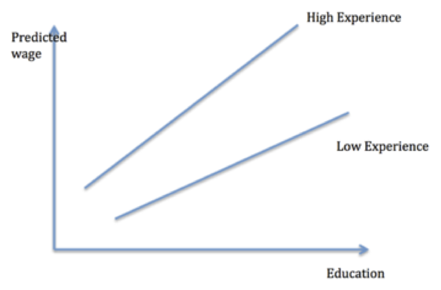

```


## Exemple


$Salaire = \beta_0 + \beta_1Etude + \beta_2Experience + \beta_3Etude*Experience + \epsilon$

- Si $\beta_3> 0$ alors une année d’expérience supplémentaire augmente l’effet de l’éducation de $\beta_3$

- Si $\beta_3 <0$ alors une année d’expérience supplémentaire diminue l’effet de l’éducation de $\beta_3$

- Si $\beta_3$ = 0 alors Aucune interaction entre les deux variables


## Exemple

```{r, echo=FALSE, out.width='80%'}

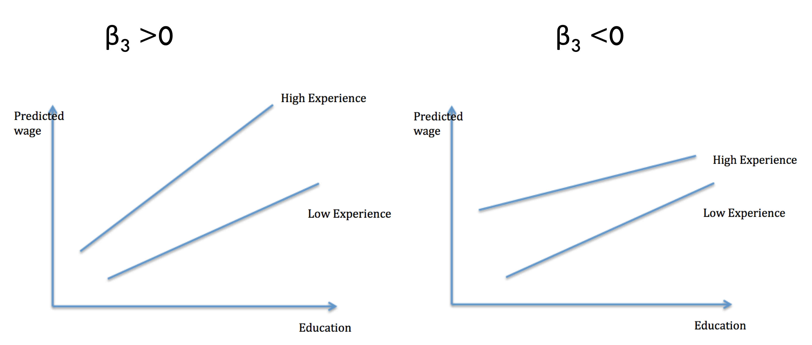

```


## Interaction entre deux variables continues

$Salaire = \beta_0 + \beta_1 Etude + \beta_2 Experience + \beta_3 Etude * Experience + \epsilon$

- $\delta(Salaire) / \delta(Etude)$ =?
- $\delta(Salaire) / \delta(Etude) = \beta_1^* + \beta_3^* Experience$
- Il est donc clair que l’effet de l’étude sur les salaires dépend de la valeur de l’expérience.
- Avoir le carré d'une variable dans une régression a la même interprétation


## Interaction entre une variable continue et une variable dichotomique (dummy)

- Considérez $salaire = \beta_0 + \beta_1 Etude + \beta_2Male + \epsilon$
    - Aucun effet d'interaction

- $Salaire = \beta_0 + \beta_1 Etude + \beta_2 Homme + \beta_3 Homme * Etude + \epsilon$
    
- L'effet de l'éducation est différent pour les hommes et les femmes
- Pour les hommes: $salaire = \beta_0 + \beta_1 Etude + \beta_2 + \beta_3 Etude$
- Pour les femmes: $salaire = \beta_0 + \beta_2 Etude$
- Sans éducation, la différence entre le salaire des femmes et celui des hommes est $\beta_1$
- Chaque année supplémentaire d'études, augmente cette différence de $\beta_3$

## Interaction entre une variable continue et une variable dichotomique (dummy)


```{r, echo=FALSE, out.width='80%'}

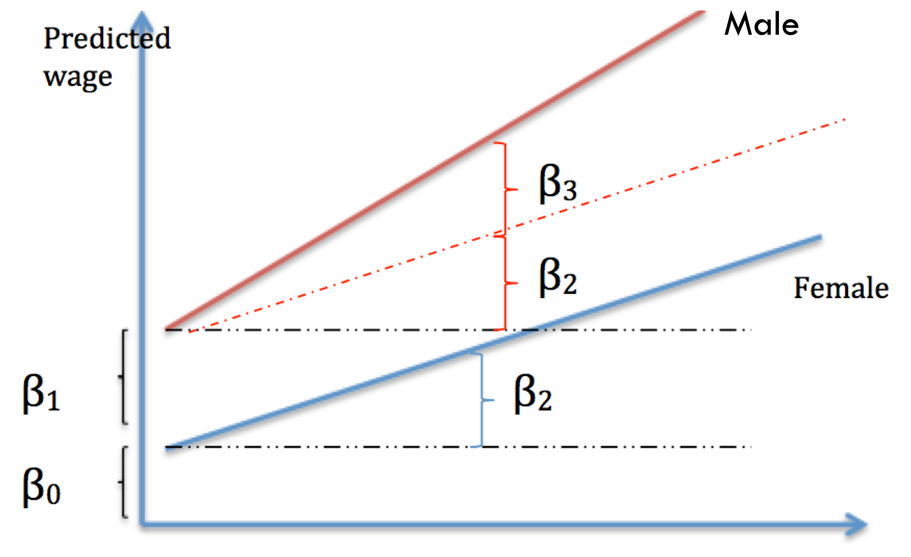

```


## Interaction entre deux variables nominales

- Prenons l’effet de deux variables nominales sur le salaire:
    - Masculin
    - Secteur d'activités

- Sans interaction:
- $Salaire = \beta_0 + \beta_1 Masculin + \beta_2 Secondaire + \beta_3 Tertiaire + \epsilon$
    - Où les références sont Femme (Homme = 0) et Secteur = primaire
    
## Interaction entre deux variables nominales

Avec interaction avec 6 catégories à considérer:


```{r, echo=FALSE, out.width='80%'}

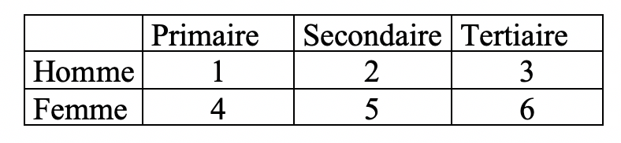

```


## Interaction entre deux variables nominales

Il faut bien considérer la référence et exécuter la régression appropriée

- $Salaire = \beta_0 + \beta_1 masculin * Prim + \beta_2 masculin * Sec + \beta_3 Fem * Prim + \beta_4 Fem * Sec + \beta_5 Fem * Ter + \epsilon$   

- Quelle est la référence?

- Devient complexe à interpréter
- Considérez une variable discrète comme variable continue si cette variable a plusieurs catégories

## 4. Multicollinéarité

- En réalité, la multicolinéraité parfaite est rare
  - La taille de l'échantillon est choisie toujours plus grande que l'IV
  - Les transformations de variables (mannequins) peuvent entraîner une multicolinéarité parfaite
    - Mais leur utilisation appropriée résout le problème

- Cependant, les relations linéaires approximatives entre les variables indépendantes sont courantes parmi les variables «économiques». C'est le cas de la multicolinéarité

## 4. Multicollinéarité

**Conséquences de la multicolinéarité**

- L'estimateur OLS en présence de multicolinéarité reste sans biais
- Le $R^2$ n'est pas affecté
- Cependant, la variance des estimations MCO des paramètres des variables colinéaires est assez grande

- Lorsque les régresseurs sont fortement corrélés, la plupart de leur variation est commune aux deux variables, laissant peu de variation propre à chaque variable - la procédure MCO a peu d'informations à utiliser pour faire ses estimations de coefficients.

## 4. Multicollinéarité

**Conséquences de la multicolinéarité**

- La multicolinéarité équivaut à avoir:
  - Très petit échantillon
  - Très peu de variation de la variable indépendante


```{r, echo=FALSE, out.width='80%'}

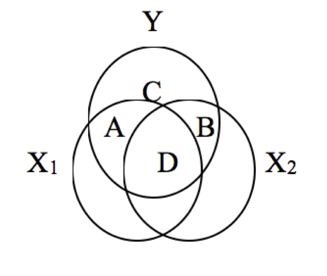

```


## 4. Multicollinéarité

**Comment détecter la multicolinéarité**

1. Analyse des résultats
- Si les signes d'hypothèse ne sont pas trouvés dans les résultats de la régression, 
- ou si les variables pertinentes ont des valeurs t non significatives, 
- lorsque les résultats ont changé substantiellement avec la suppression de IV ou l'observation
  - **Malheureusement, ces raisons sont non nécessaires ou suffisantes**

## 4. Multicollinéarité

**Comment détecter la multicolinéarité**

2. Matrice de corrélation
  - Détecter la corrélation entre deux variables spécifiques
  - Des valeurs d'environ 0,8 ou 0,9 indiquent une corrélation élevée  
  
## 4. Multicollinéarité

**Comment détecter la multicolinéarité**

3. Facteurs d'inflation de variance, VIF

- $Y = \beta_0 + \beta_1X_{1i} + \beta_2X_{2i} + ... + \beta_kX_{ki} + \epsilon$

- Régresser chaque Xi sur les autres VI et obtenir le $R^2$ appelé $R^2_i$

- $VIF_i = \frac{1}{(1-R^2_i)^)}$

-  Si $VIF_i$ > 10 indique une colinéarité nuisible

## 4. Multicollinéarité

- Que faire en cas de multicolinéarité

- Rien Si 
  1. $R^2 > R^2_i$
  2. les statistiques t sont toutes supérieures à 2

- Incorporer des informations supplémentaires
  1. Obtenez plus de données
  2. Supprimer les variables (bonne si variable non pertinente)
  3. Crér un index à partir de l'analyse factorielle, de l'analyse en composante principale ou par tout autre moyen
  

## 5. Hétéroscédasticité / perturbations autocorrélées  

Hypothèse 3: les perturbations sont sphériques

- Variance uniforme $E(\epsilon^2_i) = \sigma^2$
- Non corrélés les uns aux autres $E(\epsilon_i\epsilon_j) = 0$, si i est différent de j

## 5. Hétéroscédasticité / perturbations autocorrélées  

Exemple avec trois personnes:
- Non sphériques


```{r, echo=FALSE, out.width='80%'}

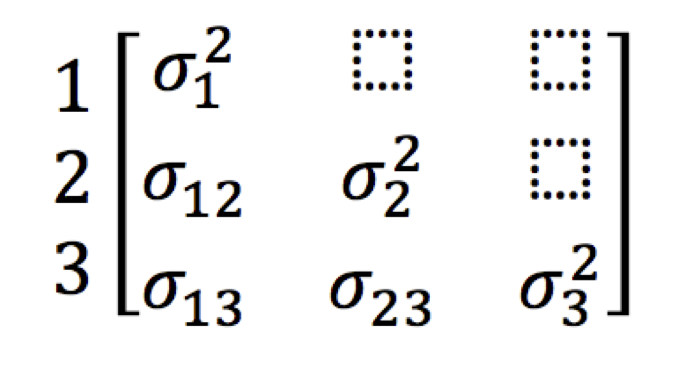

```


## 5. Hétéroscédasticité / perturbations autocorrélées  

- Sphérique

```{r, echo=FALSE, out.width='80%'}

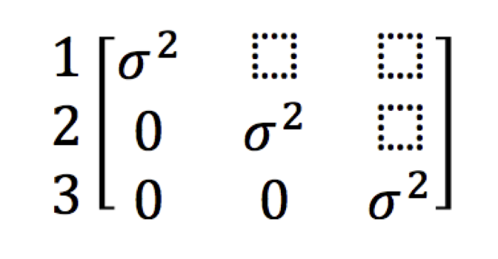

```


## 5. Hétéroscédasticité / perturbations autocorrélées  

Si l'hypothèse 3 n'est pas respectée, la régression linéaire classique devient GLS: régression linéaire généralisée

- $\beta_{OLS}$ n'est plus approprié, remplacez par $\beta_{GLS}$
- $\beta_{OLS}$ sont non-baisés mais
- Ne sont pas efficaces (grande variance)

## 5. Hétéroscédasticité / perturbations autocorrélées  

- Cas particulier des perturbations autocorrélées
  - Plan d'échantillonnage en grappes : les individus du même cluster ne sont pas indépendants
  - Donnés collectés sur les élèves de la même classe

**Correction:**

- Option (Cluster) dans la régression pour corriger l'erreur standard
- Utilisation de la modélisation multiniveaux


