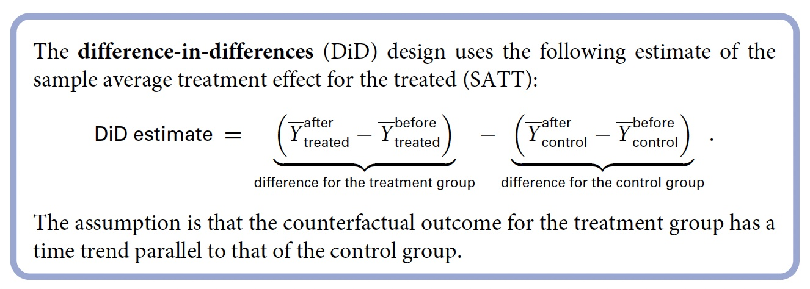

# Labo 4.2: Données observationnelles

## Introduction

Cet exemple est basé sur l'étude:

**David Card and Alan Krueger** (1994) “Minimum wages and employment: A case study of the fast-food industry in New Jersey and Pennsylvania.” American Economic Review, vol. 84, no. 4, pp. 772–793.


https://en.wikipedia.org/wiki/David_Card

- Une discussion de Imbens avec ses enfants sur la causalité

https://www.youtube.com/watch?v=uKlfqTz4-q4


- Débat actuel: augmentation du salaire minimum fédéral
- De nombreux économistes estiment que cet effet sera négatif:
    - surtout pour les pauvres
    - aussi que pour toute l'économie
- Difficile de randomiser l'augmentation du salaire minimum

## Données

- Deux chercheurs en sciences sociales ont testé cette hypothèse en utilisant des chaînes de restauration rapide au New-Jersey (NJ) et en Pennsylvanie (PA).
    - En 1992, le salaire minimum dans le New Jersey a augmenté de 4,25 dollars à 5,05 dollars
    - En Pennsylvanie, il est demeuré à 4,25 $
- NJ et PA (est) sont similaires
- Les chaînes de restauration rapide au NJ et en PA sont similaires: prix, salaires, produits, etc.
- Quel est l'impact de l'augmentation du salaire minimum au NJ?

Name                  Description
--------------------- -----------------------------------------------------
`chain`               Name of fastfood restaurant chain
                      **Nom de la chaîne de restauration rapide**
`location`            Location of restaurants (centralNJ, northNJ, PA, shoreNJ, southNJ)
                      **Localisation des restaurants**
`wageBefore`          Wage before the minimum wage increase
                      **Salaire avant l'augmentation du salaire minimum (SM)**
`wageAfter`           Wage after the minimum wage increase
                      **Salaire après l'augmentation du salaire minimum**
`fullBefore`          Number of fulltime employees before the minimum wage increase
                      **Nombre d'employés à temps plein avant l'augmentation du SM**
`fullAfter`           Number of fulltime employees after the minimum wage increase
                      **Nombre d'employés à temps plein après l'augmentation du SM**
`partBefore`          Number of parttime employees before the minimum wage increase
                      **Nombre d'employés à temps partiel avant l'augmentation du SM**
`partAfter`           Number of parttime employees after the minimum wage increase
                      **Nombre d'employés à temps partiel après l'augmentation du SM**


```{r minimum-wage, echo=FALSE, fig.cap="", out.width = '80%'}
knitr::include_graphics("../Images/minimum-wage.jpg")
```


## Données

```{r, minwage, echo=FALSE}

rm(list = ls())

library(tidyverse)
library(summarytools)

data("minwage", package = "qss")

head(minwage)

```


## ## Solution 1: Comparaison transversale (Cross-section comparison)

- Variable dépendante: proportion de la main-d'oeuvre à temps plein.

**- Comparaison transversale après l'introduction de la loi**

Comme les données sont désagrégées pour NJ par régions, nous devons d'abord créer une nouvelle variable pour l'état.

```{r}

# Création de la variable état.

minwage <-
  minwage %>% 
  mutate(state = if_else(location == "PA", "PA", "NJ"))

```


Nous devons également vérifier si la loi a eu un impact en vérifiant si le salaire a changé après la loi.

```{r}

wage_before_after <-
  minwage %>%
  group_by(state) %>%
  summarise(mean_wage_after = mean(wageAfter),
            mean_wage_before = mean(wageBefore))

wage_before_after

```


Maintenant, nous pouvons vérifier si le taux d'emploi est plus bas dans le New Jersey après la politique suggérée par la théorie économique.
Pour ce faire, nous pouvons comparer le taux d'emploi entre NJ et PA après la politique.
Mais quelle devrait être la variable dépendante? Emploi total, proportion du temps plein?

Ici, nous utilisons la proportion de temps plein comme variable dépendante. 
Quel est le problème si on utilise l'emploi total?

```{r, echo=FALSE}


  # Calcul de la variable dépendante: proportion fulltime

minwage <-
minwage %>%
  mutate(totalAfter = fullAfter + partAfter,
         fullPropAfter = fullAfter / totalAfter)

# Proportion moyenne de temps plein pour chaque État

full_prop_by_state <-
  minwage %>%
  group_by(state) %>%
  summarise(fullPropAfter = mean(fullPropAfter))
full_prop_by_state


```

## Effet de la loi


```{r}

# Difference entre NJ et PA

# Première manière

diff1 <- full_prop_by_state[[1, 2]] - full_prop_by_state[[2, 2]]
diff1

  #full_prop_by_state$fullPropAfter[1] - full_prop_by_state$fullPropAfter[2] 


```


# Deuxième manière de faire 

```{r}

pivot_wider(full_prop_by_state, names_from = state, values_from = fullPropAfter) %>%
  mutate(diff = NJ - PA)

# Deuxième manière d'écrire le code 

full_prop_by_state_pivot <-
  full_prop_by_state %>% 
  pivot_wider(names_from = state, values_from = fullPropAfter) %>% 
  mutate(diff1 = NJ - PA)

full_prop_by_state_pivot

```


Le résultat montre que le taux d'emploi moyen augmente de 4% dans le New Jersey après l'introduction de la loi. Au contraire, elle semble avoir légèrement augmenté la la proportion d'emplois à temps plein dans les fast-foods de NJ.

Pouvons-nous dire que c'est l'impact de la nouvelle loi?


## Confounding bias / Biais de confusion

L'hypothèse importante des études observationnelles est que le groupe de traitement et le groupe témoin doivent être comparables en ce qui concerne tout ce qui concerne le résultat autre que le traitement. Il est difficile de conclure que cette hypothèse est vraie dans cette étude.

- Par exemple, s'il y a une industrie concurrente pour les travailleurs peu qualifiés dans le New Jersey mais qu'une telle industrie n'existe pas en PA. Si tel est le cas, les restaurants des deux États ne sont pas comparables et les restaurants PA ne peuvent pas servir de groupe de contrôle valide pour les restaurants du New Jersey. Le NJ peut encore avoir un taux d'emploi à temps plein plus élevé, même en l'absence d'augmentation, afin d'attirer les travailleurs peu qualifiés. 

- Plus généralement, toute autre différence qui existe entre les restaurants de restauration rapide dans les deux États avant l'application de la loi NJ fausserait notre inférence si elles sont également liés à l'emploi. Les raisons qui expliquent pourquoi le salaire minimum est augmenté dans le NJ mais pas en PA peuvent également expliquer la différence des résultats. 


>>> Une variable de prétraitement qui est associée à la fois au traitement et aux variables de résultat est appelée un **facteur de confusion** et constitue une source de biais de confusion dans l'estimation de l'effet du traitement.

- L'existence possible d'un biais confondant est la raison derrière l'existence du mantra populaire, **"L'association n'implique pas nécessairement la causalité"**

Diverses solutions existent que nous verrons tout au long des cours. En voici quelques-uns pour commencer.

**1. Sous-classification (stratification)**

L'idée est de rendre les groupes de traitement et de contrôle aussi similaires que possible en les comparant au sein d'un sous-ensemble d'observations défini par des valeurs partagées dans des variables de prétraitement ou une sous-classe. Ici, nous sous-classons par type de restaurants. Quelle autre variable pourrait être intéressant à utiliser?

```{r}
# Sous-classification

## Proportion de chaque chaîne de restauration rapide dans chaque état

prop_chain <-
minwage %>% 
  group_by(state) %>% 
  count(chain) %>% 
  mutate(prop_chain = n/sum(n))
prop_chain

## Pourquoi ne pas mettre ces informations dans un graphique? Voyons voir

ggplot(prop_chain) +
  geom_point(aes(x = chain, y = prop_chain, color = state)) +
  coord_flip()                                                        

```


Le résultat montre que PA a une plus grande proportion de restaurants Burger King que NJ.


```{r}

  
## Effet par chaîne

full_prop_by_state_chain <-
  minwage %>%
  group_by(state, chain) %>%
  summarise(fullPropAfter = mean(fullPropAfter))
full_prop_by_state_chain

full_prop_by_state_chain_pivot <-
  full_prop_by_state_chain %>% 
  pivot_wider(names_from = state, values_from = fullPropAfter) %>% 
  mutate(diff1 = NJ - PA)

full_prop_by_state_chain_pivot

# Ici aussi, on peut calculer la différence

ggplot(full_prop_by_state_chain) +
  geom_point(aes(x = chain, y = fullPropAfter, color = state)) +
  coord_flip()

```


**Remarque**: Un autre facteur de confusion possible est l'emplacement des restaurants. En particulier, il se peut que les restaurants Burger King du NJ plus proches de PA donnent une comparaison plus crédible avec ceux de PA, peut-être parce que leurs économies locales partagent des caractéristiques similaires. Pour remédier à ce possible biais de confusion, nous pouvons subdiviser davantage les données sur la base de l'emplacement du restaurant. 

Faites_cela.


## Solution 2: Avant et après

Dans les études observationnelles, les données collectées au fil du temps sont une source précieuse d'informations. Les mesures multiples prises au fil du temps sur les mêmes unités sont appelées *données longitudinales ou données de panel*. Les données longitudinales donnent souvent une comparaison plus crédible des groupes de traitement et de contrôle que les données transversales car les premières contiennent des informations supplémentaires sur les changements au fil du temps.


```{r, echo=FALSE}
## Before-and-after 

minwage <-
  minwage %>% 
  mutate(fullPropBefore = fullBefore / (fullBefore + partBefore))

avant_apres <-
  minwage %>% 
  filter(state == "NJ") %>% 
  summarise(PropBefore = mean(fullPropBefore),
            PropAfter = mean(fullPropAfter), 
            diff_bef_aft_NJ = mean(fullPropAfter) - mean(fullPropBefore))

avant_apres
```

L'analyse avant-après donne une estimation qui est similaire à celles obtenues précédemment.

L'avantage de cette conception est que tout facteur de confusion spécifique à chaque état est maintenu constant car la comparaison est effectuée dans NJ. L'inconvénient est que des facteurs de confusion variant dans le temps peuvent biaiser l'inférence qui en résulte. Si, par exemple, il y a une tendance temporelle à la hausse dans l'économie locale qui améliore les salaires et l'emploi et n'est pas causée par l'augmentation du salaire minimum.


>>> La conception avant-après examine comment la variable de résultat a changé entre la période avant et après le traitement pour le même ensemble d'unités. la période de prétraitement à la période de post-traitement pour le même ensemble d'unités. Le modèle Ce modèle permet d'ajuster tout facteur de confusion spécifique à chaque unité mais qui ne change pas dans le temps. mais qui ne change pas dans le temps. Cependant, il ne permet pas de corriger les biais éventuels dus aux facteurs de confusion qui varient dans le temps.

## 3. Double différences


La conception de différence de différence étend la conception avant et après pour remédier au biais de confusion dû aux tendances temporelles. L'hypothèse clé derrière la conception DiD est que la variable de résultat suit une tendance parallèle en l'absence de traitement.

```{r, echo=FALSE}

did <- 
  minwage %>% 
  group_by(state) %>% 
  summarise(diff = mean(fullPropAfter) - mean(fullPropBefore))
did


# Effet 

did$diff[1] - did$diff[2]

# Plus directement

did_direct <- 
  minwage %>% 
  group_by(state) %>% 
  summarise(diff = mean(fullPropAfter) - mean(fullPropBefore))%>% 
  pivot_wider(names_from =state, values_from = diff) %>% 
  mutate(diff_in_diff = NJ - PA)
did_direct

```


## Enfin, mettons cela dans un graphique
Créons un seul jeu de données avec les valeurs moyennes de chaque état avant et après pour regarder visuellement chacune de ces conceptions.

```{r}

minwage

full_prop_by_state <-
  minwage %>%
  group_by(state) %>%
  summarise_at(vars(fullPropAfter, fullPropBefore), mean) %>% 
  pivot_longer(cols = c("fullPropAfter", "fullPropBefore"), names_to = "period", values_to = "fullProp") %>% 
  mutate(period = recode(period, fullPropAfter = 1, fullPropBefore = 0))

full_prop_by_state

ggplot(full_prop_by_state) +
  geom_point(aes(x = period, y = fullProp, color = state)) +
  geom_line(aes(x = period, y = fullProp, color = state)) +
  scale_x_continuous(breaks = c(0, 1), labels = c("Before", "After"))

?scale_x_continuous()
?summarise_at()
```


```{r}

knitr::include_graphics("../Images/minwage_dd.jpg")

```

- Essayer de mettre le contrefactuel dans mon graphique.

**Conclusion**

Dans le cadre du plan DiD, l'estimation de l'effet causal moyen de l'échantillon pour les restaurants NJ est la différence entre le résultat observé après l'augmentation du salaire minimum et le résultat contrefactuel dérivé de l'hypothèse de tendance temporelle parallèle. La quantité d'intérêt dans le cadre du plan DiD est appelée l'effet de traitement moyen de l'échantillon pour les traités (SATT). Le SATT diffère du SATE, qui est défini dans l'équation (2.1), car il s'applique uniquement au groupe de traitement, qui se compose des restaurants NJ dans l'exemple actuel.4 Dans la figure, cette estimation est indiquée par l'accolade. 

Pour calculer cette estimation, nous calculons d'abord la différence de résultat pour les restaurants de l'AP après et avant l'augmentation du salaire minimum dans le NJ. Nous soustrayons ensuite cette différence de l'estimation obtenue dans le cadre du modèle avant-après, qui est égale à la différence dans le NJ après et avant l'augmentation du salaire minimum. L'estimation de l'effet causal moyen est donc donnée par la différence des différences avant et après entre les groupes de traitement et de contrôle.

```{r}



```


**Quand le modèle DiD échoue-t-il ?** La conception DiD produit une estimation non valide de l'effet causal si la tendance temporelle du résultat contrefactuel pour le groupe de traitement n'est pas parallèle à celle à la tendance temporelle observée pour le groupe de contrôle. Nous ne pouvons pas vérifier cette hypothèse car la tendance temporelle contrefactuelle pour le groupe de traitement n'est pas observée. Cependant, dans certains cas, nous pouvons augmenter la crédibilité de cette hypothèse. Par exemple, si les chercheurs avaient recueilli des informations sur l'emploi auprès des restaurants périodes antérieures, ils auraient pu examiner si la proportion d'employés à temps plein dans les restaurants du NJ avait évolué parallèlement à celle des restaurants de PA lorsque le salaire minimum n'avait pas été augmenté.


## Conclusion : Résumé de trois stratégies d'identification

**Comparaison des sections transversales**
- Comparer les unités traitées avec les unités de contrôle après le traitement
- Hypothèse: les unités traitées et de contrôle sont comparables
- Possibilité de confusion spécifique à l'unité

**Comparaison avant et après**
- Comparez les mêmes unités avant et après le traitement
- Hypothèse: pas de confusion variant dans le temps

**Différence dans les différences**
- Hypothèse: tendance temporelle parallèle
- Selon cette hypothèse, il tient compte des facteurs de confusion à la fois spécifiques à l'unité et variant dans le temps

