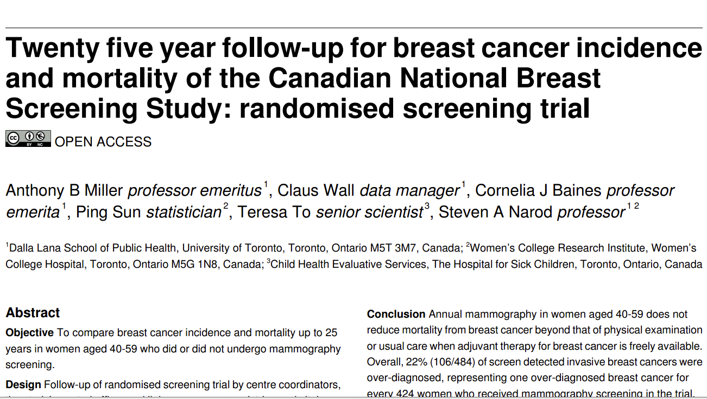
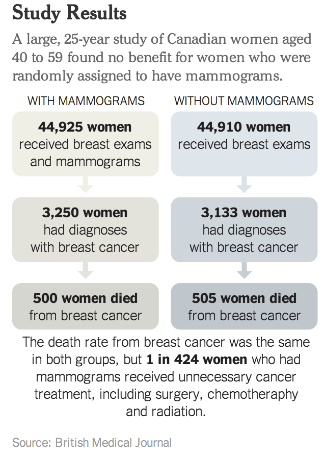

## Plan de présentation

1. Questions causales en sciences sociales et terminologie

2. Effets causaux et contrefactuel

3. Essais contrôlés randomisés (*Randomized controlled trials*) et causalité

4. Applications: 
  - Discrimination raciale sur le marché du travail


Introduction
========================================================

## Introduction
- Dans ce chapitre, nous considérons la causalité, l’un des concepts les plus centraux des sciences sociales quantitatives. 

> - Une grande partie de la recherche en sciences sociales s'intéresse aux effets causaux de diverses politiques et autres facteurs sociétaux. 
> - Par exemple: 
  >  - Est-ce que le vaccin A protège contre la maladie X?
  >  - Les classes de petite taille augmentent-elles les résultats des tests standardisés des élèves? 
  >  - Les soins de santé universels amélioreraient-ils la santé et les finances des pauvres?

## Introduction

- Par exemple: 

  >  - L'éducation réduit-elle le nombre d'enfants?
  >  - La rémunération des gens sur Wikipedia augmente-t-elle leur productivité?
  >  - Est-ce que l'augmentation du salaire minimum réduit l'activité économique?
  
  
Questions de recherche
========================================================

## Questions de recherche

- Une question de recherche est au cœur d'un projet de recherche, d'une étude ou d'une revue de littérature. 
- Il concentre l'étude, détermine la méthodologie et guide toutes les étapes de la recherche, de l'analyse et de la production de rapports.
- Peut être **associatif** ou **causal**


## Exemple 1

1. Le salaire minimum augmente-t-il le taux de chômage?

  > - Le taux de chômage a augmenté après l'augmentation du salaire minimum.
  > - Le taux de chômage aurait-il augmenté si l'augmentation du salaire minimum n'avait pas eu lieu?


## Exemple 2

2. La race/l'ethnie a-t-elle une incidence sur les perspectives d'emploi?
    - Mohamed a postulé pour un emploi mais ne l'a pas obtenu.
    - Mohamed aurait-il trouvé un travail s'il était blanc (avait un nom européen)?


## Exemple 3

3. Est-ce que fumer cause une maladie coronarienne?
    - Jean, fumeur, a eu une maladie coronarienne.
    - Est-ce que Jean aurait eu la même maladie s'il n'était pas fumeur?

## Exemple 4
  
4. Quelle est l'importance des questions souverainistes dans la victoire de François Legault?
    - Au cours des élections de 2018, la question souverainiste a été laissée de côté et François Legault a gagné.
    - François Legault aurait-il gagné les élections si ces questions étaient présentes?

## Exemple 5

5. L'augmentation des salaires des enseignants augmente-t-elle l'apprentissage des élèves?


## Terminologie

1. **Réponse ou variable dépendante**, *outcome*
  - C'est ce que nous voulons expliquer.
  - *Exemples*:
      - Taux de chômage
      - Perspective d'emploi
      - Maladie coronarienne
      - Victoire de François Legault

## Terminologie
    
2. **Variable indépendante, facteur de risque**
  - Tout facteur pouvant influencer la variable de réponse
  - Peut être de différents niveaux
  - Leur choix dépend de la théorie
  - *Exemples*:
    - Salaire minimum
    - Ethnie / Race
    - Fumer
    - Questions souverainistes

3. **Variables de contrôle**

## Comment répondre à ces questions

- Regarder les différences dans les données

  > - Par exemple: On peut constater que les élèves réussissent mieux dans les écoles qui offrent des salaires élevés aux enseignants

## Comment répondre à ces questions
  
> - Problèmes: Les écoles où les enseignants gagnent plus peuvent être différentes à bien des égards. 
> - Par exemple, les élèves des écoles où les salaires des enseignants sont élevés peuvent provenir de familles plus riches. 
  > - Ainsi, ce qui ressemble à un effet des enseignants pourrait simplement provenir de la comparaison de différents types d'élèves. 
  > - Ces différences non mesurées entre les étudiants sont appelées des **facteurs de confusion** et, en général, la possibilité de facteurs de confusion nuit à la capacité des chercheurs à répondre aux questions de cause à effet en recherchant des modèles dans les données existantes.


## Comment répondre à ces questions

 - Une solution au problème des facteurs de confusion consiste à essayer de faire des comparaisons équitables en ajustant les différences observables entre les groupes. 

 - Par exemple, 

  > - vous pourrez peut-être télécharger des données sur la taxe foncière à partir d'un certain nombre de sites Web gouvernementaux. 
  > - Ensuite, vous pouvez comparer les performances des élèves dans les écoles où les prix des logements sont similaires mais les salaires des enseignants sont différents
  > - Vous pourriez toujours constater que les élèves apprennent davantage dans les écoles où les salaires des enseignants sont plus élevés. 


## Comment répondre à ces questions

> - Qu'en est-il des autres facteurs de confusion: 

  > - Niveau d'éducation des parents
  > - proximité des bibliothèques publiques
  > - Salaire élevé des directeurs dans les écoles qui paient de gros salaires aux enseignants

## Comment répondre à ces questions
    
> - Vous pouvez également essayer de mesurer et d'ajuster ces facteurs, mais la liste des facteurs de confusion possibles est essentiellement infinie. 

> - Dans de nombreuses situations, vous ne pouvez tout simplement pas mesurer et ajuster tous les facteurs de confusion possibles. 

>- En réponse à ce défi, les chercheurs ont développé un certain nombre de techniques pour faire des estimations causales à partir de données non expérimentales (deuxième partie)

## Présentation de Joshua Angrist

- Ceteris Paribus: Public vs. Private University

https://youtu.be/iPBV3BlV7jk


Type de relation
========================================================

## Association 

- On dit que deux variables A et B sont **associées** quand l’une se trouve plus communément en présence de l’autre.

> - Se détecte souvent à partir d'un tableau dit de **contingence** ou **tableau croisé** ou d'un graphique

## Association 

 - Exemple  

> - Existe-il une association entre le degré d'ouverture d'un pays et l'attitude face a la violence contre les femmes?

  > - Pierotti, Rachel. (2013). "[Increasing Rejection of Intimate Partner Violence: Evidence of Global Cultural Diffusion](http://dx.doi.org/10.1177/0003122413480363)." *American Sociological Review*, 78: 240-265. 


  > - Nous utilisons les données des enquêtes démographiques et de santé (EDS), qui représentent un ensemble de plus de 300 enquêtes représentatives à l'échelle nationale, régionale et résidentielle menées dans des pays en développement du monde entier depuis 1992.

## Association 

Name                Description
---------------     ---------------------------------------------------------
`beat_burnfood`     Pourcentage de femmes dans chaque pays qui 
                    pensent qu'un mari a le droit de battre sa femme 
                    si elle brûle la nourriture (quantitative)
`beat_burnfood_cat` Variable beat_bunfood en 4 catégories (qualitative)
`no_media`          Pourcentage de femmes dans chaque pays qui ont 
                    rarement accès un journal, une radio ou une
                    télévision (quantitative)
`no_media_cat`      Variable no_media en 3 catégories (qualitative)
`country`           pays


## Association 

```{r, echo=FALSE, out.width = '75%', echo=FALSE, warning=FALSE, message=FALSE}

getwd()
library(tidyverse)
library(summarytools)

dhs_ipv <- read_csv("../Data/dhs_ipv.csv")

dhs_ipv <-
  dhs_ipv %>% 
 # select(beat_burnfood!= "NA") %>% 
  mutate(beat_burnfood_cat = factor(ntile(beat_burnfood, 4), labels = c('Très faible', 'Faible', 'Élevé', 'Très élevé')),
         beat_goesout_cat = factor(ntile(beat_goesout, 4), labels = c('Très faible', 'Faible', 'Élevé', 'Très élevé')),
         no_media_cat = factor(ntile(no_media, 3), labels = c('Riche', 'Moyen', 'Pauvre'))) 

head(dhs_ipv)
```  

## Association

- Résumé de l'information contenue dans la base de donnée

```{r, out.width = '65%', echo=FALSE}

summary(dhs_ipv)

```

## Association 

- Association entre deux variables qualitatives

```{r, echo=FALSE, out.width = '75%', warning=FALSE, message=FALSE}

ggplot(dhs_ipv) +
  geom_bar(aes(x = no_media_cat, fill = beat_burnfood_cat), position = "dodge") +
  ggtitle("Association entre ouverture aux médias et acceptation de la violence conjugale") +
  xlab("Type de pays selon l'ouverture aux médias") +
  ylab("Effectif") +
  theme_bw()

```  

## Association 

  - Représentation graphique (boxplot) dans le cas d'une variable qualitative et d'une variable quantitative
  
```{r, out.width = '70%', message = FALSE, echo=FALSE, warning=FALSE}

ggplot(dhs_ipv) +
  geom_boxplot(aes(x = no_media_cat, y = beat_burnfood, color = no_media_cat)) +
  ggtitle("Association entre ouverture aux médias et acceptation de la violence conjugale") +
  xlab("Type de pays selon l'ouverture aux médias") +
  ylab("% qui estime qu'une femme doit être battue (beat_burnfood)") 

```  


## Association 

  - Représentation linéaire (scatterplot) et de calcul d'indicateurs (corrélation de Pearson): dans le cas de deux variables quantitatives.

```{r, out.width = '75%', message = FALSE, warning=FALSE, echo=FALSE}

ggplot(dhs_ipv, aes(x = no_media, y = beat_burnfood)) +
  geom_point() 

```


## Association 

```{r, out.width = '75%', message = FALSE, warning=FALSE, echo=FALSE}

ggplot(dhs_ipv, aes(x = no_media, y = beat_burnfood)) +
  geom_point(aes(color = region)) +
  geom_smooth(aes(color = region), method = lm, se = FALSE,  formula = y ~ x)

```


## Relation associative

- Une association (linéaire) peut être 
  
   - 1. **positive** si les deux variables vont dans le même sens (une augmentation de l'une est associée à une augmentation de l'autre);
  
   - *Exemple* : éducation et revenu, durée de résidence et emploi

## Relation associative

- Une association (linéaire) peut être
  
   - 2. **négative** si les deux variables vont dans des sens opposés (une augmentation de l'un est associée à une diminution de l'autre);
  
   - *Exemple* : scolarisation et racisme, revenu et obésité, niveau de développement d'un pays et niveau de mortalité infantile
  
## Relation associative

- Une association (linéaire) peut être  

   - 3. **nulle** (Absence d'association).
  
   - *Exemple*:  


Causalité
========================================

## Relation causale

 - L'association est une **condition nécessaire** à la causalité (Mais elle **n'est pas suffisante**).

> - Toutes les associations ne sont pas causales. L'association peut arriver par hasard.

> - **L'analyse statistique à elle seule ne peut constituer une preuve d'un lien de causalité**
> - Comparaison entre **$\color{red}{factuel}$** et **$\color{red}{contrefactuel}$**
> - Problème fondamental de l'inférence causale: 
  > - Il faut déduire des résultats contrefactuels
  > - Il n'y a pas de causalité sans manipulation: caractéristiques immuables


## Relation causale


 - La clé pour comprendre la causalité est de penser au **contrefactuel**. 

> - L'inférence causale est une comparaison entre le factuel (ce qui s'est réellement passé) et le contrefactuel (ce qui se serait passé si une condition était différente).

> - Contrefactuels ne sont pas observés, sauf dans les films.

> - https://www.youtube.com/watch?v=BvUbv4iwbDs&rel=0&modestbranding=1&autohide=1&showinfo=0


Essais contrôlés randomisés (Expérimentation)
========================================================


## Expérimentation

 - Les expériences permettent aux chercheurs d'aller au-delà des corrélations dans les données naturelles afin de répondre de manière fiable à certaines questions de cause à effet. 

> - À l'ère de l'analogique, les expériences étaient souvent difficiles et coûteuses d'un point de vue logistique. 

> - Aujourd'hui, à l'ère du numérique, les contraintes logistiques disparaissent progressivement. Non seulement il est plus facile de faire des expériences comme celles faites dans le passé, mais il est maintenant possible d'exécuter de nouveaux types d'expériences.

## Expérimentation

 - Deux manières différentes de voir la chose

> 1. Expérience: Dans une expérience, un chercheur intervient dans le monde et mesure ensuite un résultat. 

 > - Cette approche est décrite comme **$\color{red}{\text{«perturber et observer»}}$**.
 
 > - Les expériences de perturbation et d’observation ne concernent qu’un seul groupe ayant reçu l’intervention, et les résultats peuvent donc conduire les chercheurs à la mauvaise conclusion.

## Expérimentation

 2. Dans une **$\color{red}{\text{expérience contrôlée randomisée}}$**, un chercheur intervient pour certaines personnes et pas pour d'autres, et le chercheur décide quelles personnes reçoivent l'intervention par randomisation (par exemple, lancer une pièce). 

> - Les expériences contrôlées randomisées créent des comparaisons équitables entre deux groupes: l'un qui a reçu l'intervention et l'autre qui n'en a pas. 

> - En d'autres termes, les expériences contrôlées randomisées sont une solution aux problèmes de facteurs de confusion.

> - Malgré les différences importantes entre les expériences et les expériences contrôlées randomisées, les chercheurs en sciences sociales utilisent souvent ces termes de manière interchangeable. 

## Essais contrôlés randomisés

 - Idée clé: la **randomisation** du traitement rend les groupes de **traitement** et de **contrôle** en moyenne "identiques"

> - Les deux groupes sont similaires en termes de toutes les caractéristiques (**observées et non observées**)

> - Peut attribuer les différences moyennes de résultats à la différence de traitement

> - Effet du Traitement Moyen (Sample Average Treatment Effect, SATE)


## Essais contrôlés randomisés

$$SATE = \frac{1}{n} \sum_{i=1} ^n {Y_i(1) - Y_i(0)}$$


- Essais contrôlés randomisés comme **norme d'excellence** (*Gold standard*)


## Essais contrôlés randomisés

 - La SATE n'est pas directement observable. 

> - Pour le groupe de traitement qui a reçu le traitement, nous avons observé le résultat moyen sous le traitement, mais nous ne savons pas quel aurait été leur résultat moyen sans le traitement. 

> - Le même problème existe pour le groupe témoin car ce groupe ne reçoit pas le traitement et, par conséquent, nous n'observons pas le résultat moyen qui se produirait dans les conditions de traitement. 

> - Pour estimer le résultat contrefactuel moyen du traitement, nous pouvons utiliser le résultat moyen observé du groupe témoin. 

## Essais contrôlés randomisés

 - De même, nous pouvons utiliser le résultat moyen observé du groupe de traitement comme une estimation du résultat contrefactuel moyen pour le groupe de contrôle. 

> - La SATE peut être estimée en calculant la différence entre le résultat moyen entre les groupes de traitement et témoin

> - En clair, la grande question de la causalité n'est qu'une question de soustraction :)

## Essais contrôlés randomisés

> - Dans un essai contrôlé randomisé (ECR), chaque unité est assignée de manière aléatoire au groupe de traitement ou au groupe de contrôle. 

> - La **randomisation** de l'assignation de traitement garantit que la différence moyenne de résultats entre les groupes de traitement et de contrôle peut être attribuée uniquement au traitement, car les deux groupes sont en moyenne identiques pour toutes les caractéristiques de prétraitement (observées et non observées).


## Essais contrôlés randomisés

1.  **Forces**  
  - **Validité interne** - mesure dans laquelle les hypothèses de causalité sont satisfaites dans l'étude

2. **Limites**
  - **Validité externe** - mesure dans laquelle les conclusions peuvent être généralisées au-delà d'une étude particulière

3. **Autres problèmes**

 > - Explication causale faible
 > - Considérations éthiques
 > - Possibilité de contamination


Applications
========================================================

## Exemple 1: Est-ce que la mammographie sauve des vies? 

```{r, out.width='70%', echo = FALSE, fig.align = 'center'}



```

## Exemple 1: Est-ce que la mammographie sauve des vies?

```{r, out.width='50%', echo = FALSE, fig.align = 'center'}



```

## Exemple 2 discrimination raciale sur le marché du travail

1. **Question de recherche**
  - La discrimination raciale existe-t-elle sur le marché du travail?
  - Ou bien les disparités raciales dans le taux de chômage devraient-elles être attribuées à d'autres facteurs tels que les écarts raciaux dans le niveau d'instruction?

## Exemple 2 discrimination raciale sur le marché du travail

2. **Expérimentation**

- En réponse aux annonces dans les journaux, les chercheurs ont envoyé les CV de candidats fictifs à des employeurs potentiels.
- Changé seulement le nom du demandeur d'emploi
  - Noms afro-américains
  - Noms à consonance caucasienne
- Les autres informations sont inchangées

## Exemple 2 discrimination raciale sur le marché du travail

3. **Variable dépendante**
  - Taux de rappel


## Exemple 2 discrimination raciale sur le marché du travail

 - **Unité d'analyse**: Individus

> - **Variable de traitement** (variable d’intérêt causal) **T**: Nom à consonance afro-américain

> - **Groupe de traitement** (unités traitées): Afro-américains

> - **Groupe de contrôle** (unités non traitées): Caucasiens

> - **Réponse** (variable de réponse) **Y**: si un rappel a été effectué

  > - Que signifie **"T cause Y"**? 
  > - Contrefactuels, **"Quoi si"** : Les Afro-Américains auraient-ils été rappelés s'ils n'avaient pas de noms afro-américains?


## Exemple 2 discrimination raciale sur le marché du travail

- **Deux résultats possibles**: Y(1) et Y(0)

- **Effet causal**: `Y(1) - Y(0)`

- **Problème fondamental d'inférence causale**: un seul des deux résultats potentiels est observable


## Exemple 2 discrimination raciale sur le marché du travail

- Comment pouvons-nous comprendre les contrefactuels?
  - L'association n'est pas un lien de causalité
  - Trouvez une unité similaire! ==> **Matching**
  - Est-ce-que Jamal n'a été rappelé à cause de sa race?
  - Trouver une personne blanche qui ressemble à Jamal 

- Le problème: on ne peut pas correspondre sur tout
- Facteurs de **confusion non observés**: variables associées au traitement et au résultat ==> **biais de sélection**


## Exemple 2 discrimination raciale sur le marché du travail

- La clé pour comprendre la causalité est de penser au contrefactuel. L'inférence causale est une comparaison entre le factuel (ce qui s'est réellement passé) et le contrefactuel (ce qui se serait passé si une condition était différente).


```{r pressure, echo=FALSE, fig.cap="A caption", out.width = '80%'}
knitr::include_graphics("../Images/factuel_contrafactuel.jpg")
```


- La toute première observation des données de l’expérience de CV montre qu’un employeur potentiel a reçu un CV avec un nom stéréotypé afro-américain et a décidé de rappeler.

- Avec quoi remplaçons-nous les **?** dans le tableau?

## Labo 4.1: Données expérimentales

## Exemple 2 discrimination raciale sur le marché du travail


```{r, echo=FALSE}
library(tidyverse)
library(summarytools)
```

## Exemple 2 discrimination raciale sur le marché du travail

```{r, echo=FALSE}

data("resume", package = "qss")
# resume <- read_csv("resume.csv")        # What you will do to import the data (remember your directory)
head(resume) 

```

## Exemple 2 discrimination raciale sur le marché du travail

```{r, out.width = '80%'}

freq(resume$sex)

```

## Exemple 2 discrimination raciale sur le marché du travail

```{r, out.width = '80%'}

freq(resume$race)

```

## Exemple 2 discrimination raciale sur le marché du travail

```{r, out.width = '80%',}

freq(resume$call)

```

## Y'a-t-il discrimination ou pas?

```{r, out.width = '80%',}

ctable(resume$race, resume$call)

```
- SATE = 9,65 - 6,45 = 3,2%

## Est-ce que les deux groupes étaient similaires au début?

```{r, out.width = '80%',}

ctable(resume$race, resume$sex)

```


## Exemple 3: Expérimentation à l'ère digitale

Lire chapitre 4 de Matthews Salganik

## Présentation par Joshua Angrist

- Randomized Trials: The Ideal Weapon

https://www.youtube.com/watch?v=eGRd8jBdNYg


Références
========================================================

## Références

- Salganik(https://www.bitbybitbook.com/en/1st-ed/running-experiments/)
- Gerber, Alan S. and Donald P. Green, Field Experiments: Design, Analysis, and Interpretation. Chapters 1 and 2.
- Stephen, Morgan & Chistopher Winship. 2018. Counterfactuals and Causal Inference: methods and principles for Social research, 2rd edition. Chapter 2.
- Shelley, Clark et al. 2019. “The Impact of Childcare on Poor Urban Women’s Economic Empowerment in Africa”. Demography, 56, 4.
- Mirna Safi et Patrick Simon. 2013. "Les discriminations ethniques et raciales dans l’enquête Trajectoires et Origines: représentations, expériences subjectives et situations vécues." Économie et Statistiques, No 464-465-466. (A discuter en classe)

