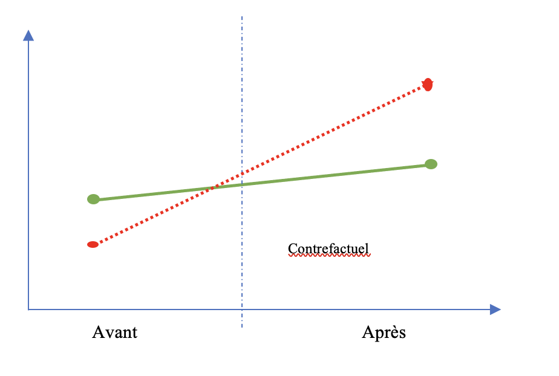
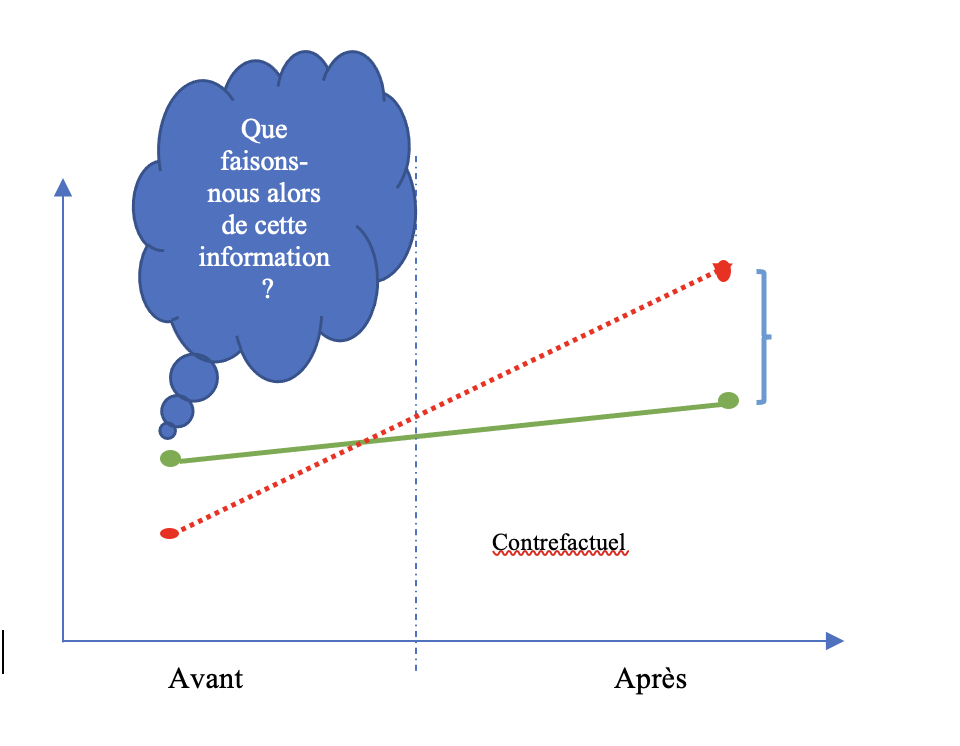
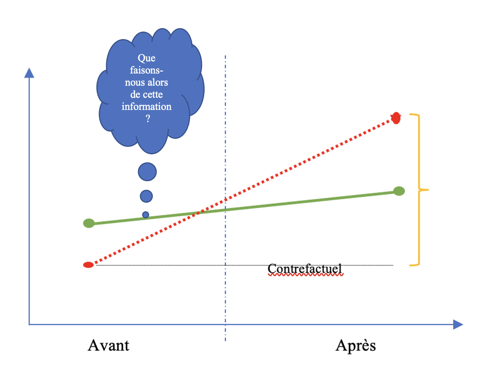
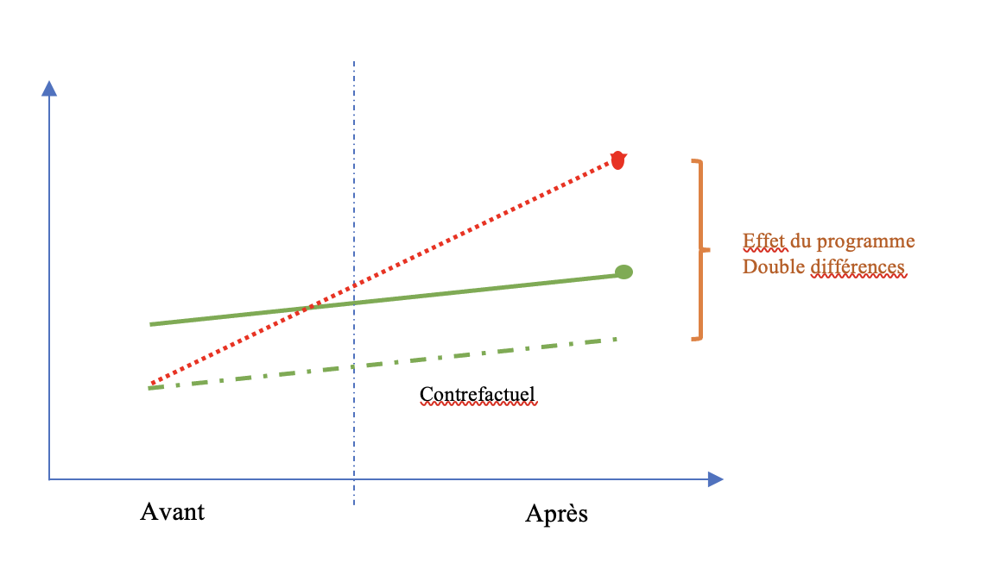

## Plan de présentation

1. Causalité à partir des données observationnelles 
2. Pour aller plus loin
3. Pour la semaine prochaine


Causalité à partir des données observationnelles
========================================================

## Données observationnelles

- Souvent, nous ne pouvons pas "randomiser" le traitement pour des raisons éthiques et logistiques:
- par exemple, tabagisme et cancer du poumon

- Études observationnelles: traitement naturellement attribué
- Plans d'observation passifs ou plans corrélationnels
- Pas d'assignation aléatoire, pas de groupe de contrôle...

## Données observationnelles

- Meilleure validité externe pour la généralisation au-delà de l'expérience
- Validité interne plus faible:
  - les variables pré-traitement peuvent différer entre les groupes (traitement et contrôle)

>  1. **biais de confusion (Confounding bias)** dû à ces différences : Une variable de prétraitement associée aux variables de traitement et de résultat s'appelle un facteur de confusion et constitue une source de biais de confusion dans l'estimation de l'effet du traitement.
    
>  2. **biais de confusion non observée (Unobserved confounding)** constitue la ménace la plus importante car il est inobservé.

## Données observationnelles

3. **biais de sélection (selection bias)** de l'auto-sélection au traitement: Le biais de confusion dû à l'auto-sélection dans le groupe de traitement s'appelle un biais de sélection. Un biais de sélection apparaît souvent dans les études d'observation car les chercheurs n'ont aucun contrôle sur le destinataire du traitement.

- Contrôle statistique devient alors nécessaire


## Données observationnelles

```{r endogeneite, echo=FALSE, fig.cap="", out.width = '100%'}
knitr::include_graphics("../Images/endogeneite.jpg")
```


## Exemples

Il y a beaucoup d'accidents pendant les périodes de fête de Noël, donc la fête de Noël cause des accidents.

```{r confounding, echo=FALSE, fig.cap="", out.width = '80%'}
knitr::include_graphics("../Images/confounding.jpg")
```

Problèmes?

## Exemples

- Adjiwanou, V. et LeGrand, T. (2013). Does antenatal care matter in the use of skilled birth attendance in rural Africa: A multi-country analysis, Social Science & Medicine 86: 26-34.
    - Est-ce que le fait d'avoir des consultations prénatales entraîne un accouchement à l'hopital?

- Adjiwanou, V., al. (Forthcoming). Stepfamilies in sub-Saharan Africa and their consequences in terms of children’s well-being, Presented at the Population Association of America (PAA) 2017.
    - Est-ce que le fait de vivre avec son beau-père réduit les chances de scolarisation?


## Conditions de cause à effet

1. **Préséance temporelle (temporal precedence)**: la cause présumée doit survenir avant l'effet présumé

2. **Association**: il y a covariance observée, c'est-à-dire que la variation de la cause présumée doit être liée à celle de l'effet présumé

3. **Isolement (isolation)**: Il n'y a pas d'autres explications alternatives plausibles (c.-à-d. Des variables étrangères) de la covariation entre la cause présumée et l'effet présumé


Solutions
========================================================

## Solution 1: Comparaison transversale (Cross-section comparison)

- Comparez les unités traitées avec les unités de contrôle après le traitement
- Hypothèse: les unités traitées et les unités de contrôle sont comparables
- Possibilité de confusion

```{r cross-sectional, echo=FALSE, fig.cap="", out.width = '70%'}

knitr::include_graphics("../Images/cross_sectional.jpg")

```

## Solution 2

2. Comparaison avant-après (Before_and_after comparison)
    - Comparez les mêmes unités avant et après le traitement
    - Hypothèse: pas de variable de confusion qui change dans le temps

```{r Before-After, echo=FALSE, fig.cap="", out.width = '80%'}
knitr::include_graphics("../Images/Before-After.jpg")
```

## Solution 3

3. Double différence (DD) - Difference-in-differences
    - Compare les individus entre périodes et entre traitement et contrôle 
    - Hypothèse: tendance temporelle parallèle
    - Tient compte à la fois des facteurs de confusion spécifiques aux unités et variables dans le temps. 


```{r Double-difference1, echo=FALSE, fig.cap="", out.width = '80%'}

```

## Solution 3 (faux)


```{r Double-difference2, echo=FALSE, fig.cap="", out.width = '80%'}

```


## Solution 3 (faux)


```{r Double-difference3, echo=FALSE, fig.cap="", out.width = '80%'}

```


## Solution 3 (vrai)


```{r Double-difference4, echo=FALSE, fig.cap="", out.width = '80%'}

```


## Solution 3 (Résumé)

```{r Double-difference, echo=FALSE, fig.cap="", out.width = '80%'}
knitr::include_graphics("../Images/Double_difference.jpg")
```


Application
========================================================

## Exemple 1: Comment l'augmentation du salaire minimum affecte-t-elle l'emploi?

 - Débat actuel: augmentation du salaire minimum fédéral
 - De nombreux économistes estiment que cet effet sera négatif:
  - surtout pour les pauvres
  - aussi pour toute l'économie

## Exemple 1: Comment l'augmentation du salaire minimum affecte-t-elle l'emploi?

 - Difficile de randomiser l'augmentation du salaire minimum

> - Deux chercheurs en sciences sociales ont testé cette technique en utilisant des chaînes de restauration rapide au New-Jersey (NJ) et en Pennsylvanie (PA).
 > - En 1992, le salaire minimum dans le New Jersey a augmenté de 4,25 dollars à 5,05 dollars
 > - En Pennsylvanie, il est demeuré à 4,25 dollars
> - NJ et PA (est) sont similaires
> - Les chaînes de restauration rapide au NJ et en PA sont similaires: prix, salaires, produits, etc.
> - Quel est l'impact de l'augmentation du salaire minimum au NJ?

# Labo 4.2: Données observationnelles


