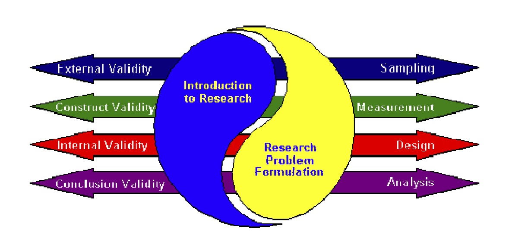
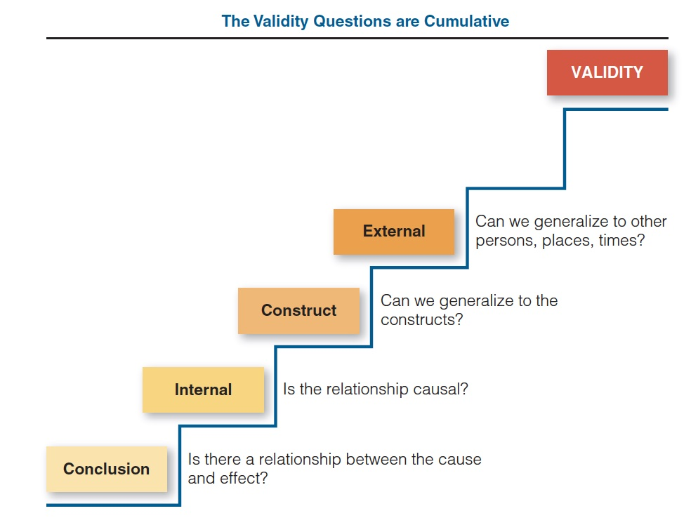

## Plan de présentation

1. Pour aller plus loin
2. Les autres problèmes


Causalité à partir des données observationnelles - extension
========================================================

## 1. Modèles à effets fixes (semblable à la double différence)

- Adjiwanou, V., al. 2020. Stepfather families and children’s schooling in sub-Saharan Africa: A cross national study. Demographic Research (forthcoming in Volume 43).
    - Est-ce que le fait de vivre avec son beau-père réduit les chances de scolarisation?

## 2. Modèles d'équations structurelles

- Adjiwanou, V. et LeGrand, T. (2013). Does antenatal care matter in the use of skilled birth attendance in rural Africa: A multi-country analysis, Social Science & Medicine 86: 26-34.
    - Est-ce que le fait d'avoir des consultations prénatales entraîne un accouchement à l'hopital?

## 3. Variables instrumentales

- Devoir 2

## 4. Propensity score matching

- Adjiwanou, V. et LeGrand, T. (2013). Does antenatal care matter in the use of skilled birth attendance in rural Africa: A multi-country analysis, Social Science & Medicine 86: 26-34.
    - Est-ce que le fait d'avoir des consultations prénatales entraîne un accouchement à l'hopital?


Les autres problèmes qui peuvent affecter la causalité
========================================================

## Validité

 - Les chercheurs font de nombreuses inférences ou conclusions lors de la recherche. Beaucoup d'entre eux sont liés au processus de recherche et ne sont pas les principales hypothèses de l'étude. 

> - Néanmoins, comme les briques qui entrent dans la construction d'un mur, ces processus intermédiaires et propositions méthodologiques fournissent la base des conclusions de fond qu'ils souhaitent aborder. 

> - Par exemple, pratiquement toutes les recherches sociales impliquent des mesures ou des observations et, peu importe ce que les chercheurs mesurent ou observent, ils se demandent s'ils mesurent ce qu'ils ont l'intention de mesurer ou comment leurs observations sont influencées par les circonstances dans lesquelles elles sont faites. 

> - Ils parviennent à des conclusions sur la qualité de leurs mesures - conclusions qui joueront un rôle important dans le traitement des questions de fond plus larges de leur étude.

## Validité

- La validité peut être définie comme la meilleure approximation disponible de la vérité d'une proposition, inférence ou conclusion donnée

- Nous avons déjà discuté de deux types de validité:
  - Validité interne (causalité)
  - Validité externe (généralisation)
  

## Validité

<!--Source: Trochim, W.R. and J.P. Donnely. 2007. The research methods knowledge base (3rd ed.). Mason, OH: Atomic Dog.]-->

```{r Double-difference, echo=FALSE, fig.cap="", out.width = '80%'}


```

## Validité

**Validité de la conclusion (analyse)**
- Y a-t-il une relation entre la cause et l'effet?

**Validité interne (conception)**
- La relation est-elle causale?

**Validité de la construction (mesure)**
- Pouvons-nous généraliser aux constructions?

**Validité externe (échantillonnage)**
- Pouvons-nous généraliser à d'autres personnes, lieux, moments

## Validité

```{r , echo=FALSE, fig.cap="", out.width = '80%'}


```

## Conclusion

- Votre question de recherche est l'élément central de votre recherche
- 5 éléments structurels d'une étude empirique
  1. Échantillons (groupes)
  2. Conditions (traitement ou contrôle)
  3. Méthode d'attribution aux groupes ou conditions (c.-à-d. Aléatoire ou autre)
  4. Observations (c'est-à-dire les données)
  5. L'heure ou le calendrier de mesure ou le début ou la fin du traitement

## Conclusion

- Une grande attention doit être accordée à chaque élément de la «trinité» de la recherche (conception, mesure et analyse)

**Le meilleur ordinateur de recherche est votre cerveau**
